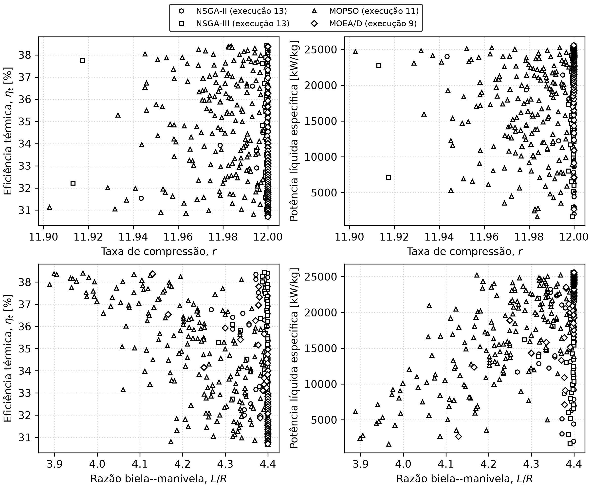
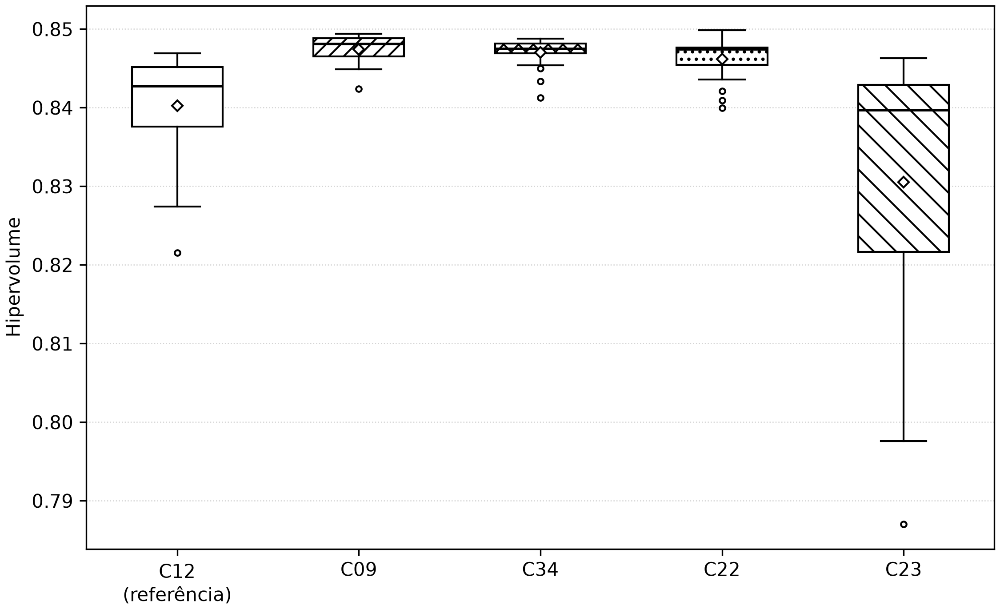
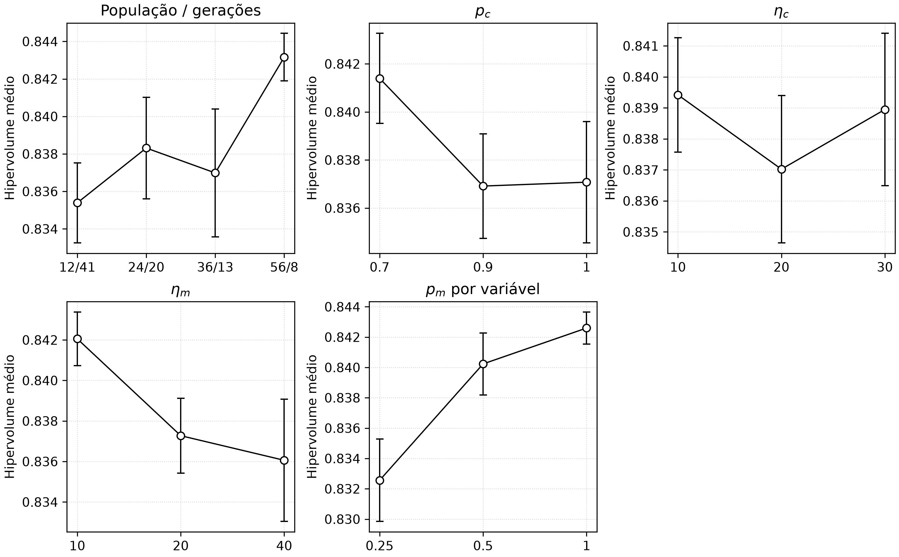
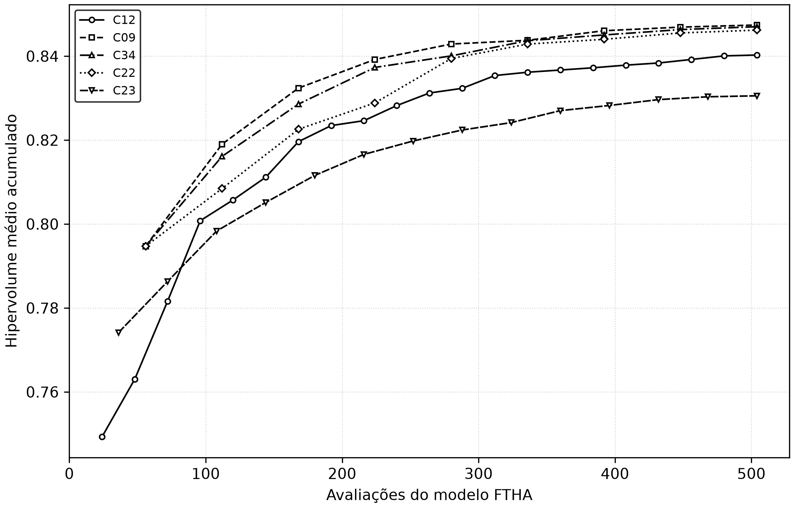

# FTHA Optimization

Modelo numérico do ciclo Otto com adição de calor em tempo finito (FTHA,
*Finite-Time Heat Addition*), baseado no trabalho de Naaktgeboren (2017). O
projeto teve origem em um estudo da disciplina de Máquinas Térmicas do curso de
Engenharia Mecânica da UTFPR, campus Guarapuava, e prepara o modelo
termodinâmico para uso posterior em otimização multiobjetivo.

A implementação reutilizável encontra-se em [`src/FTHA.py`](src/FTHA.py).

## Modelo

O ciclo preserva as hipóteses ar-padrão e de gás ideal do ciclo Otto, mas
substitui a adição instantânea de calor a volume constante por uma liberação de
calor com duração angular finita. Assim, o modelo incorpora:

- a geometria biela-manivela;
- a posição angular do virabrequim;
- o instante de ignição;
- a duração da adição de calor;
- o histórico acumulado de liberação de calor;
- calores específicos dependentes da temperatura.

Compressão, adição de calor e expansão são discretizadas em subprocessos
politrópicos. A rejeição de calor que fecha o ciclo permanece isocórica. O
sistema é fechado, internamente reversível e sem atrito, vazamentos ou perdas de
pressão; portanto, o modelo é apropriado para análise termodinâmica, mas não
substitui uma simulação de combustão ou um modelo preditivo de motor real.

### Geometria biela-manivela

Para um cilindro com volume deslocado unitário $V_{d,u}$, volume de folga
$V_c$ e taxa de compressão $r$,

$$
V_c=\frac{V_{d,u}}{r-1}.
$$

No motor quadrado usado no artigo, $D=S$, com raio da manivela $R=S/2$ e
comprimento da biela $L$. O deslocamento do pistão a partir do PMS é

$$
x(\alpha)=R(1-\cos\alpha)
+L\left[1-\sqrt{1-\left(\frac{R}{L}\right)^2\sin^2\alpha}\right],
$$

e o volume instantâneo é

$$
V(\alpha)=V_c+\frac{\pi D^2}{4}x(\alpha).
$$

Nesta implementação, $\alpha=0$ corresponde ao ponto morto superior (PMS) e
$\alpha=\pm\pi$ ao ponto morto inferior (PMI).

### Adição de calor

Se $N$ é a rotação em rpm e $\Delta t_c$ é o tempo de combustão, a duração
angular da adição de calor é

$$
\omega=\frac{2\pi N}{60},
\qquad
\delta=\omega\Delta t_c.
$$

Para uma ignição iniciada em $\theta$, a fração acumulada de calor é modelada
por

$$
y(\alpha)=
\begin{cases}
0, & \alpha<\theta,\\
\dfrac{1}{2}-\dfrac{1}{2}
\cos\!\left[\dfrac{\pi(\alpha-\theta)}{\delta}\right],
& \theta\leq\alpha\leq\theta+\delta,\\
1, & \alpha>\theta+\delta.
\end{cases}
$$

O calor específico fornecido no intervalo $i\rightarrow i+1$ é

$$
q_i=\left[y(\alpha_{i+1})-y(\alpha_i)\right]q_{in}.
$$

### Propriedades e solução numérica

O fluido obedece a $Pv=R_gT$. Os coeficientes dos polinômios de terceiro grau
para $c_p(T)$, armazenados em [`data/data.csv`](data/data.csv), são usados por
[`src/gas_prop.py`](src/gas_prop.py) para calcular $c_v(T)$, energia interna,
temperatura, pressão e volume específico.

Cada intervalo de volume variável é tratado como um subprocesso politrópico,

$$
Pv^{n_i}=C_i,
$$

com trabalho positivo quando realizado sobre o gás:

$$
w_i^{on}
=\frac{P_i v_i}{1-n_i}
\left[1-\left(\frac{v_i}{v_{i+1}}\right)^{n_i-1}\right].
$$

A Primeira Lei é aplicada por unidade de massa,

$$
u_{i+1}=u_i+q_i+w_i^{on},
$$

e o expoente $n_i$ é corrigido iterativamente até que trabalho, energia
interna, temperatura, pressão e equação de estado sejam consistentes. Intervalos
com $v_i\simeq v_{i+1}$ são tratados como isocóricos.

## Verificação numérica com os testes paramétricos do artigo

A reprodução numérica considera a série publicada para $r=12$ e
$\theta=-5^\circ$, variando somente a duração angular da adição de calor:

$$
\delta\in\{10^\circ,30^\circ,50^\circ,70^\circ,90^\circ,110^\circ\}.
$$

Os demais parâmetros permanecem fixos:

| Parâmetro | Valor |
|---|---:|
| Volume deslocado unitário | 250 cm³ |
| Relação biela/manivela, $L/R$ | 5 |
| Taxa de compressão, $r$ | 12 |
| Ângulo de ignição, $\theta$ | −5° |
| Estado inicial | 300 K e 100 kPa |
| Calor específico fornecido, $q_{in}$ | 1.000 kJ/kg |
| Fluido de trabalho | CO₂ |
| Intervalos de compressão e expansão | 90 por processo |
| Passo durante a adição de calor | 0,5° |

O valor $L/R=5$ é mantido apenas para reproduzir o caso publicado e fica fora
do domínio construtivo $[3{,}2,4{,}4]$ usado posteriormente na otimização.

[`src/article_validation.py`](src/article_validation.py) executa os seis testes
com o polinômio de terceiro grau disponível em
[`data/data.csv`](data/data.csv). O artigo-base informa uma correlação de quinta
ordem para o CO₂ nesses testes; portanto, esta etapa verifica a concordância das
respostas, não a identidade das correlações termofísicas. O artigo apresenta as
eficiências com três algarismos significativos, correspondentes a uma casa
decimal nessa faixa. Arredondados à mesma precisão, os valores calculados
reproduzem todos os valores publicados:

| $\delta$ | 10° | 30° | 50° | 70° | 90° | 110° |
|---:|---:|---:|---:|---:|---:|---:|
| $\eta_t$ publicada | 38,4% | 37,0% | 34,1% | 30,6% | 27,0% | 23,7% |
| $\eta_t$ calculada, arredondada | 38,4% | 37,0% | 34,1% | 30,6% | 27,0% | 23,7% |
| Diferença na precisão publicada | 0,0 p.p. | 0,0 p.p. | 0,0 p.p. | 0,0 p.p. | 0,0 p.p. | 0,0 p.p. |

Na precisão publicada, a diferença observável é 0,0 ponto percentual nos seis
casos. Como as saídas originais não arredondadas não estão disponíveis,
comparações com casas adicionais não são reportadas nem interpretadas como erro.
O teste de regressão arredonda os resultados calculados a uma casa decimal e
exige igualdade exata com a tabela do artigo. Também verifica a redução
monotônica da eficiência e da pressão máxima com o aumento de $\delta$, além das
dimensões das seis malhas.

### Diagrama $\log(P)\times\log(v)$

O aumento de $\delta$ reduz a separação entre compressão e expansão, diminuindo
a área interna do ciclo. A pressão ao fim da expansão aumenta, indicando maior
potencial de produção de trabalho descartado com o fluido.


### Diagrama $P\times v$

Em escala linear, observa-se diretamente a redução do trabalho líquido e do pico
de pressão. Para os maiores valores de $\delta$, a pressão máxima passa a ocorrer
ao final da compressão.


### Diagrama $P\times\alpha$

As diferenças concentram-se ao redor do PMS e no início da expansão. Uma adição
de calor mais longa reduz e desloca o pico de pressão porque parte maior da
energia é fornecida enquanto o pistão se afasta do PMS.


### Diagrama $T\times v$

Com o aumento de $\delta$, o gás leva uma faixa angular maior para aquecer e
atinge a temperatura máxima em volumes específicos maiores. Resta menos curso
para expansão, elevando a temperatura de descarga e reduzindo a eficiência.


## Análise de sensibilidade

[`src/sensitivity_analysis.py`](src/sensitivity_analysis.py) preserva um corte
operacional de 120 pontos, no qual apenas $N$ e $\theta$ variam com a geometria
herdada, e acrescenta uma triagem de 3.000 pontos que cruza também cinco níveis
de $r$ e cinco de $L/R$. A duração temporal de 2,5 ms converte cada rotação na
duração angular $\delta=2\pi N\Delta t_c/60$.

### Ponto de referência do estudo

No caso-base, os parâmetros fixos são:

| Parâmetro | Valor |
|---|---:|
| Volume deslocado unitário | 250 cm³ |
| Número de cilindros | 1 |
| Relação biela/manivela, $L/R$ | 5 |
| Taxa de compressão, $r$ | 12 |
| Rotação, $N$ | 4.800 rpm |
| Início da ignição, $\theta$ | −15° |
| Duração temporal da adição de calor, $\Delta t_c$ | 2,5 ms |
| Duração angular da adição de calor, $\delta$ | 72° |
| Estado inicial | 300 K e 100 kPa |
| Calor específico fornecido, $q_{in}$ | 1.000 kJ/kg |
| Fluido de trabalho | CO₂ |
| Intervalos de compressão e expansão | 90 por processo |
| Passo durante a adição de calor | 0,5° |

Este ponto de referência também usa a geometria herdada $L/R=5$ e não é uma
solução admissível da nova busca construtiva.

O histórico dos 325 estados resultantes está em
[`reports/case_study_base_case_states.csv`](reports/case_study_base_case_states.csv),
e os indicadores estão em
[`reports/case_study_base_case_summary.csv`](reports/case_study_base_case_summary.csv).
Os resultados do caso-base são:

| Indicador | Resultado |
|---|---:|
| Eficiência térmica, $\eta_t$ | 33,257% |
| Trabalho específico de compressão | 198,172 kJ/kg |
| Trabalho específico de expansão | 530,739 kJ/kg |
| Trabalho líquido específico | 332,567 kJ/kg |
| Potência líquida específica | 13.302,7 kW/kg |
| Razão de consumo de trabalho, $r_{ct}$ | 0,373 |
| Pressão máxima, $P_{max}$ | 3.026,2 kPa |
| Temperatura máxima, $T_{max}$ | 1.281,3 K |

#### Diagrama $\log(P)\times\log(v)$ do caso-base

O ciclo fechado inclui a rejeição isocórica de calor. A separação entre os
ramos de compressão e expansão representa o trabalho líquido positivo do ciclo.


#### Diagrama $P\times v$ do caso-base

Em escala linear, o pico de pressão de 3.026,2 kPa ocorre próximo ao menor
volume específico, durante a liberação finita de calor.


#### Diagrama $P\times\alpha$ do caso-base

A região hachurada identifica a adição de calor entre $\theta=-15^\circ$ e
$\theta+\delta=57^\circ$. A hachura mantém essa informação legível em impressão
preto e branco.


#### Diagrama $T\times v$ do caso-base

A temperatura cresce durante a compressão e a adição de calor, alcança
1.281,3 K e diminui ao longo da expansão. O fechamento vertical representa a
rejeição de calor a volume constante.


#### Diagrama $n\times\alpha$ do caso-base

Fora da adição de calor, o expoente politrópico permanece próximo ao valor
determinado pelas propriedades do CO₂. Durante a liberação de calor, sua grande
variação representa a combinação entre transferência de energia e mudança de
volume; os pontos isocóricos não possuem expoente finito.


Os cinco diagramas e os cinco gráficos da análise de sensibilidade usam a mesma
identidade visual monocromática. Curvas, hachuras, padrões de traço e marcadores
fornecem codificação redundante para impressão em preto e branco.

### Varredura de rotação e instante de ignição

São avaliadas 120 combinações entre 20
rotações, de 500 a 10.000 rpm em passos de 500 rpm, e seis instantes de ignição:

$$
\theta\in\{-120^\circ,-96^\circ,-72^\circ,-48^\circ,-24^\circ,0^\circ\}.
$$

Todos os demais parâmetros permanecem iguais aos da tabela do ponto de
referência e, portanto, aos valores da implementação local usados na reprodução.
A malha conserva 90 intervalos antes e depois da adição de calor e passo de 0,5°
durante esse processo; por isso, seu número de estados varia de 196 a 481
conforme $N$.

Como $\Delta t_c$ é constante, a duração angular da adição de calor cresce de
7,5° a 150° ao longo da faixa de rotação. Essa relação explica por que o
instante de ignição mais favorável se desloca para ângulos mais adiantados
quando a rotação aumenta.

Os dados completos estão em
[`reports/sensitivity_analysis.csv`](reports/sensitivity_analysis.csv), e os
extremos globais são salvos separadamente em
[`reports/sensitivity_analysis_summary.csv`](reports/sensitivity_analysis_summary.csv).
A triagem construtiva está em
[`reports/design_space_screening.csv`](reports/design_space_screening.csv), com
extremos em
[`reports/design_space_screening_summary.csv`](reports/design_space_screening_summary.csv).

#### Resultados numéricos

A varredura produziu os seguintes limites globais:

| Indicador | Mínimo ($N$; $\theta$) | Máximo ($N$; $\theta$) |
|---|---:|---:|
| Eficiência térmica | 4,718% (500 rpm; −120°) | 38,280% (500 rpm; 0°) |
| Potência líquida específica | 196,6 kW/kg (500 rpm; −120°) | 25.672,8 kW/kg (10.000 rpm; −72°) |
| Razão de consumo de trabalho | 0,340 (500 rpm; 0°) | 0,938 (500 rpm; −120°) |
| Pressão máxima | 2.225,5 kPa (4.500 rpm; 0°) | 7.831,7 kPa (500 rpm; −120°) |
| Temperatura máxima | 1.171,4 K (10.000 rpm; −24°) | 1.961,0 K (500 rpm; −120°) |

Os resultados ótimos dentro de cada série de instante de ignição são:

| $\theta$ | $\eta_{t,max}$ | $N(\eta_{t,max})$ | $\dot{w}_{liq,max}$ | $N(\dot{w}_{liq,max})$ | $r_{ct,min}$ | $N(r_{ct,min})$ |
|---:|---:|---:|---:|---:|---:|---:|
| −120° | 23,122% | 10.000 rpm | 19.268,2 kW/kg | 10.000 rpm | 0,650 | 10.000 rpm |
| −96° | 28,594% | 10.000 rpm | 23.828,0 kW/kg | 10.000 rpm | 0,536 | 10.000 rpm |
| −72° | 31,809% | 8.000 rpm | **25.672,8 kW/kg** | 10.000 rpm | 0,453 | 10.000 rpm |
| −48° | 34,849% | 5.500 rpm | 24.078,1 kW/kg | 10.000 rpm | 0,401 | 7.000 rpm |
| −24° | 37,349% | 2.500 rpm | 19.564,1 kW/kg | 10.000 rpm | 0,358 | 3.500 rpm |
| 0° | **38,280%** | 500 rpm | 13.872,4 kW/kg | 9.500 rpm | **0,340** | 500 rpm |

Essa tabela explicita três resultados da sensibilidade:

1. o ponto de máxima eficiência desloca-se continuamente para ignições mais
   adiantadas conforme a rotação ótima aumenta: 500 rpm em $0^\circ$, 2.500 rpm
   em $-24^\circ$, 5.500 rpm em $-48^\circ$, 8.000 rpm em $-72^\circ$ e o
   limite de 10.000 rpm em $-96^\circ$ e $-120^\circ$;
2. a maior potência específica não ocorre no ponto de maior eficiência: o
   máximo de 25.672,8 kW/kg exige 10.000 rpm e $\theta=-72^\circ$;
3. a menor razão de consumo de trabalho também depende da combinação entre
   rotação e ignição, variando de 0,340 a 0,650 entre os mínimos das seis
   séries.

Entre 500 e 10.000 rpm, a pressão máxima diminui em todas as séries, com redução
entre 16,1% ($\theta=-120^\circ$) e 61,1% ($\theta=0^\circ$). A temperatura máxima também
diminui, entre 15,4% e 31,2%. Portanto, o aumento de rotação alivia os picos
termodinâmicos, mas não garante simultaneamente a melhor eficiência ou a maior
potência.

As figuras desta seção adotam uma identidade visual própria, diferente da
verificação numérica do artigo-base. Todas as séries são pretas e cada instante
de ignição tem simultaneamente um padrão de traço e um marcador exclusivos. Assim, a leitura
permanece possível em tela, fotocópia ou impressão em preto e branco.

#### Eficiência térmica

A eficiência máxima global, 38,280%, ocorre em 500 rpm e $\theta=0^\circ$.
Entretanto, um único avanço de ignição não é ótimo em toda a faixa: o pico de
eficiência passa de 0° em 500 rpm para −24° em 2.500 rpm, −48° em 5.500 rpm e
−72° em 8.000 rpm. O avanço compensa o aumento da duração angular da adição de
calor e mantém uma parcela maior da liberação de energia próxima ao PMS.


#### Potência líquida específica

A potência líquida específica incorpora simultaneamente o trabalho líquido do
ciclo e sua frequência de repetição. Por isso, seu máximo não coincide com o
de eficiência: são obtidos 25.672,8 kW/kg em 10.000 rpm e $\theta=-72^\circ$.
Esse desacoplamento evidencia um compromisso relevante para a futura
otimização multiobjetivo.


#### Razão de consumo de trabalho

A menor razão de consumo de trabalho, 0,340, coincide com o ponto de maior
eficiência. Para ignições muito adiantadas, uma parcela maior do calor é
fornecida durante a compressão, aumentando a fração do trabalho de expansão
consumida para comprimir o fluido.


#### Pressão e temperatura máximas

Pressão e temperatura máximas são maiores com ignições antecipadas e baixas
rotações. O caso $N=500$ rpm e $\theta=-120^\circ$ atinge simultaneamente os
maiores valores, 7.831,7 kPa e 1.961,0 K. O alongamento angular da adição de
calor nas rotações elevadas reduz os picos, mas também altera eficiência e
potência; portanto, esses indicadores constituem restrições concorrentes, e
não apenas respostas a serem minimizadas isoladamente.


## Otimização multiobjetivo de eficiência e potência

O estudo resolve simultaneamente as duas otimizações propostas,

$$
\max_{\mathbf{x}}\;\eta_t(\mathbf{x})
\qquad\text{e}\qquad
\max_{\mathbf{x}}\;\dot{w}_{liq}(\mathbf{x}),
\qquad
\mathbf{x}=[N,\theta,r,L/R],
$$

sem reduzir o problema a uma única soma ponderada global. O resultado de cada
execução é, portanto, uma aproximação da frente de Pareto: melhorar um dos
indicadores exige aceitar perda no outro.

### Domínio e modelo termodinâmico

As quatro decisões são contínuas:

- $500\leq N\leq10.000$ rpm;
- $-120^\circ\leq\theta\leq0^\circ$;
- $8\leq r\leq12$;
- $3{,}2\leq L/R\leq4{,}4$.

$N$ determina a frequência dos ciclos e a duração angular da combustão;
$\theta$ posiciona a liberação de calor em relação ao PMS. A taxa de
compressão entra diretamente em $V_c=V_{du}/(r-1)$ e altera os estados da
compressão e expansão. O intervalo adotado contém a faixa usual de motores SI
indicada por [Pulkrabek](https://books.google.com/books?id=6TzCFgAACAAJ) e
preserva $r=12$ do caso FTHA publicado. A razão $L/R$ altera a cinemática do
pistão e o tempo próximo ao PMS; seu efeito termodinâmico depende do perfil de
liberação de calor e das perdas, como discutido por
[Suzuki et al.](https://doi.org/10.4271/2006-32-0098). O limite inferior
aproxima $L/R=3{,}205$ do Toyota 1ZZ-FE
([SAE 981087](https://doi.org/10.4271/981087)); o superior reproduz o extremo
de uma faixa paramétrica publicada. Esses são limites do estudo, não uma
recomendação universal de projeto.

Com $\Delta t_c=2{,}5$ ms, a duração angular é
$\delta=6N\Delta t_c$, variando de 7,5° a 150°. Os limites escolhidos mantêm
$\theta+\delta\leq180^\circ$ em todo o domínio. Volume deslocado e número de
cilindros ficam fixos porque os objetivos são específicos e o modelo ar-padrão
não representa transferência de calor às paredes, atrito, enchimento, massa
dos componentes nem outros efeitos de escala. Nessas hipóteses, variar apenas
essas grandezas redimensionaria a potência total, sem mudar o caminho de volume
específico. Já $r$ e $L/R$ alteram diretamente as equações do ciclo. Estado
inicial, $q_{in}$, CO₂ e malha seguem os valores usados na reprodução. Cada
avaliação chama diretamente o modelo com 90
intervalos antes e depois da adição de calor e passo de 0,5° durante a
combustão; não foi usado metamodelo ou interpolação.

As decisões são normalizadas em $[0,1]^4$ para os operadores não privilegiarem
a rotação apenas por sua escala numérica. Para o mesmo motivo, as funções de
minimização fornecidas aos algoritmos são $-\eta_t/40\%$ e
$-\dot{w}_{liq}/27.000$, escalas fixas arredondadas acima dos máximos da análise
fatorial de 3.000 pontos. Escala positiva não altera dominância de Pareto.

### Algoritmos, frameworks e parâmetros

Foram comparados quatro métodos com 48 candidatos e 100 gerações completas
após a população inicial: **4.848 avaliações exatas por execução**. Em dois
objetivos, 47 partições produzem 48 pontos uniformes do NSGA-III; a população
coincide com essas direções e é múltipla de quatro para o torneio DCD do
NSGA-II. As 100 gerações estão no intervalo de 80–120 ciclos examinado no
[MOPSO original](https://doi.org/10.1109/CEC.2002.1004388) e ampliam a
profundidade da busca para quatro decisões; sua suficiência é verificada pela
trajetória do hipervolume, e não presumida pelo número nominal.

Cada método é executado 21 vezes com sementes independentes, totalizando 84
execuções e 407.232 chamadas do FTHA. Vinte e uma repetições superam as 20 do
estudo original do NSGA-III, permitem que a mediana corresponda a uma execução
observada e mantêm o custo viável; são um compromisso de orçamento, não uma
garantia universal de poder estatístico.

| Método | Implementação e escolhas |
|---|---|
| NSGA-II | [DEAP `selNSGA2`](https://deap.readthedocs.io/en/master/api/tools.html#deap.tools.selNSGA2), torneio DCD e elitismo. SBX usa $p_c=0{,}9$ e $\eta_c=20$; mutação polinomial usa $\eta_m=20$ e $p_m=1/n_{var}=0{,}25$ por variável. Esses valores são uma referência consolidada para variáveis reais no [NSGA-II de Deb et al.](https://doi.org/10.1109/4235.996017): cruzamento frequente e perturbações majoritariamente locais, com uma coordenada mutada em média. |
| NSGA-III | [DEAP `selNSGA3`](https://deap.readthedocs.io/en/stable/examples/nsga3.html), os mesmos operadores e 48 pontos de referência ($p=47$). Compartilhar os operadores isola o efeito da seleção; não se afirma que seja a configuração original exata de [Deb e Jain](https://doi.org/10.1109/TEVC.2013.2281535). |
| MOPSO | 48 partículas, $\omega=0{,}4$ e $c_1=c_2=1$, conforme [Coello Coello e Lechuga](https://doi.org/10.1109/CEC.2002.1004388). O arquivo externo $4N=192$ aproxima o repositório de 200 soluções do estudo original. A perturbação local, explicitamente uma adaptação desta implementação, tem probabilidade inicial 0,10, desvio 0,10 no espaço normalizado e decai até zero para combinar exploração inicial e estabilidade final. |
| MOEA/D | [`MOEAD` do pymoo](https://pymoo.org/algorithms/moo/moead.html), 48 direções, Tchebycheff, 10 vizinhos e probabilidade 0,9 de acasalamento local. Dez vizinhos mantêm aproximadamente os 20% usados com população 100 no [trabalho original](https://doi.org/10.1109/TEVC.2007.892759); 0,9 prioriza cooperação local e reserva 10% para interações globais. |

As versões, sementes e todos os hiperparâmetros estão registrados de forma
legível por máquina em
[`reports/multiobjective_configuration.csv`](reports/multiobjective_configuration.csv).

Uma avaliação que não conclua a iteração politrópica dentro da tolerância
continua contando no orçamento e recebe objetivos escalonados $(0,0)$. Como toda
solução física útil tem ambos os objetivos de minimização negativos, essa
penalização é dominada e não entra na frente final.

### Estatísticas e critério de melhor solução

Uma frente não possui uma única “melhor” solução sem preferência externa. Para
calcular média e desvio padrão de decisões e respostas, cada execução fornece
um ponto de compromisso: primeiro calculam-se ideal e nadir da frente não
dominada combinada das 84 execuções; em seguida escolhe-se a menor distância
euclidiana ao ideal, com perdas de eficiência e potência normalizadas pelo
intervalo ideal–nadir e pesos iguais. A melhor solução de cada algoritmo é o
menor valor desse mesmo escore entre todas as suas frentes.

O hipervolume usa a referência física $(\eta_t,\dot{w}_{liq})=(0,0)$ após as
escalas fixas. Valores maiores indicam simultaneamente melhor convergência e
cobertura. O tempo contém seleção e as 4.848 avaliações exatas, mas não a criação
inicial do conjunto de processos, compartilhado por todo o experimento. O
paralelismo altera apenas o tempo: sementes, avaliações e resultados não
dependem da ordem de conclusão das tarefas.

### Resultados das 21 execuções

As 84 execuções concluíram as 407.232 avaliações previstas
($4\times21\times4.848$). Média e desvio padrão das métricas de qualidade e
custo foram:

| Algoritmo | Hipervolume médio ± DP | Melhor hipervolume | Tempo médio ± DP [s] |
|---|---:|---:|---:|
| NSGA-II | **0,845957 ± 0,000148** | 0,846259 | **23,87 ± 2,39** |
| NSGA-III | 0,844977 ± 0,000755 | 0,846350 | 25,16 ± 2,75 |
| MOPSO | 0,845922 ± 0,000717 | **0,847139** | 23,89 ± 1,95 |
| MOEA/D | 0,840189 ± 0,004676 | 0,844662 | 139,55 ± 3,19 |

O NSGA-II apresentou o maior hipervolume médio, mas a diferença para o MOPSO
foi apenas 0,004% e a diferença para o NSGA-III, 0,116%. O MOPSO encontrou a
melhor frente isolada; suas medianas e as do NSGA-II também ficaram muito
próximas (0,846005 e 0,845967, respectivamente). O MOEA/D obteve hipervolume
médio 0,682% abaixo do NSGA-II e levou 5,85 vezes mais tempo. Esse custo decorre
da atualização sequencial dos subproblemas vizinhos na implementação do pymoo,
que aproveita menos o paralelismo entre avaliações. As diferenças pequenas de
qualidade entre os três primeiros métodos não sustentam uma alegação de
superioridade universal.

O MOPSO pode devolver até 192 membros de seu repositório, enquanto os outros
métodos devolvem no máximo 48 membros da população. O hipervolume foi calculado
sobre a saída completa de cada método; portanto, ele mede a frente efetivamente
entregue ao usuário, mas parte da vantagem de densidade de uma execução MOPSO
decorre dessa memória externa. A conclusão mais robusta é a estabilidade do
NSGA-II, não superioridade universal de um algoritmo.

Os pontos de compromisso de pesos iguais apresentaram as seguintes médias
entre sementes:

| Algoritmo | $N$ médio ± DP [rpm] | $\theta$ médio ± DP [°] | $r$ médio ± DP | $L/R$ médio ± DP | $\eta_t$ média ± DP [%] | Potência média ± DP [kW/kg] |
|---|---:|---:|---:|---:|---:|---:|
| NSGA-II | 5.231 ± 150 | −38,08 ± 1,27 | 11,9996 ± 0,0006 | 4,389 ± 0,032 | 35,527 ± 0,139 | 15.486,1 ± 382,3 |
| NSGA-III | 5.201 ± 151 | −37,49 ± 1,31 | 11,9994 ± 0,0011 | 4,383 ± 0,027 | 35,558 ± 0,142 | 15.409,4 ± 384,6 |
| MOPSO | **5.159 ± 103** | −37,07 ± 1,11 | 11,9866 ± 0,0109 | 4,221 ± 0,081 | **35,570 ± 0,098** | **15.292,5 ± 264,3** |
| MOEA/D | 5.166 ± 134 | **−37,30 ± 1,10** | 11,9998 ± 0,0003 | **4,385 ± 0,026** | 35,590 ± 0,124 | 15.321,5 ± 343,4 |

O negrito destaca a menor dispersão de cada coluna, e não o melhor valor de um
objetivo. Os quatro métodos localizaram a mesma região de compromisso,
aproximadamente 5.200 rpm, 37–38° antes do PMS, $r\simeq12$ e $L/R$ elevado.
A concentração de $r$ no limite superior deve ser interpretada como tendência
do modelo ar-padrão, que não representa detonação nem restrições mecânicas, e
não como recomendação direta para um motor real.

As melhores soluções de compromisso — menor distância normalizada ao ideal —
foram:

| Algoritmo | Execução | $N$ [rpm] | $\theta$ [°] | $r$ | $L/R$ | $\eta_t$ [%] | Potência [kW/kg] | Escore |
|---|---:|---:|---:|---:|---:|---:|---:|---:|
| NSGA-II | 4 | 5.260,9 | −37,961 | 11,9992 | 4,3998 | 35,507 | 15.566,8 | 0,398507 |
| NSGA-III | 12 | 5.239,1 | −37,406 | 11,9999 | 4,3999 | 35,528 | 15.511,4 | **0,398451** |
| MOPSO | 9 | 5.225,9 | −38,194 | 11,9999 | 4,2894 | 35,526 | 15.471,3 | 0,399447 |
| MOEA/D | 5 | 5.245,3 | −38,007 | 11,9998 | 4,3942 | 35,521 | 15.526,8 | 0,398533 |

As diferenças entre esses escores são pequenas: não há evidência de que uma
dessas quatro alternativas de compromisso domine as demais. A escolha final
depende da preferência entre eficiência e potência. Nos extremos das frentes
armazenadas, a maior eficiência foi 38,434% em 500,0 rpm, −3,652°,
$r=12,0000$ e $L/R=4,3730$, com 1.601,5 kW/kg; a maior potência foi
25.583,0 kW/kg em 10.000,0 rpm, −70,912°, $r=12,0000$ e $L/R=4,4000$, com
eficiência de 30,700%. Esses extremos refinam a varredura discreta e confirmam
o conflito entre os objetivos.




A figura mostra a execução de maior hipervolume de cada método. Padrões de
traço e marcadores redundantes mantêm as quatro frentes distinguíveis em
impressão preto e branco.


Os resultados completos podem ser auditados em:

- [`reports/multiobjective_pareto_solutions.csv`](reports/multiobjective_pareto_solutions.csv):
  6.994 soluções não dominadas, com as quatro decisões, semente e execução;
- [`reports/multiobjective_run_statistics.csv`](reports/multiobjective_run_statistics.csv):
  84 linhas com hipervolume, ponto de compromisso e tempo;
- [`reports/multiobjective_summary.csv`](reports/multiobjective_summary.csv):
  médias, desvios padrão e melhor solução por algoritmo;
- [`reports/multiobjective_best_solutions.csv`](reports/multiobjective_best_solutions.csv):
  os quatro compromissos destacados na tabela anterior.

## Análise de sensibilidade do NSGA-III

A sensibilidade investiga os hiperparâmetros do otimizador, mantendo o domínio
de $[N,\theta,r,L/R]$, os parâmetros físicos fixos, a malha angular e os dois
objetivos. Para separar efeito algorítmico de esforço, todas as configurações
recebem exatamente 4.848 avaliações do FTHA.

### Desenho experimental e fatores

População e número de gerações variam em pares que satisfazem
$N_{pop}(N_{ger}+1)=4.848$:

| População | Gerações | Partições/pontos de referência |
|---:|---:|---:|
| 12 | 403 | 11/12 |
| 24 | 201 | 23/24 |
| 48 | 100 | 47/48 |
| 101 | 47 | 100/101 |

Em duas dimensões, `uniform_reference_points(nobj=2, p)` produz $p+1$ pontos;
por isso população e resolução das direções de referência são tratadas como um
único fator de alocação do orçamento. Os outros fatores e níveis são:

| Fator | Níveis |
|---|---|
| Probabilidade de cruzamento, $p_c$ | 0,7; 0,9; 1,0 |
| Índice de distribuição SBX, $\eta_c$ | 10; 20; 30 |
| Índice de distribuição da mutação, $\eta_m$ | 10; 20; 40 |
| Probabilidade de mutação por variável, $p_m$ | 0,125; 0,25; 0,50 |

O total de 4.848 avaliações reproduz o custo da configuração-base,
$48(100+1)$. Os níveis de $p_c$ cobrem cruzamento frequente a obrigatório; os
índices de distribuição incluem o valor 20 usado como referência e operadores
progressivamente mais exploratórios ou concentrados. Como há quatro decisões,
$p_m=0{,}25=1/n_{var}$ é o centro natural; 0,125 e 0,50 testam metade e dobro
dessa pressão de mutação. O operador de mutação é chamado para cada descendente
e $p_m$ determina, dentro dele, a probabilidade aplicada a cada variável.

O espaço fatorial completo possui 324 combinações. Foi usada uma amostra Latin
Hypercube discreta, única e reprodutível de 36 configurações. Como 36 é
divisível por quatro e por três, cada par população/gerações aparece nove vezes
e cada nível dos demais fatores aparece doze vezes. A configuração usada na
comparação de algoritmos — 48 indivíduos, 100 gerações, $p_c=0{,}9$,
$\eta_c=\eta_m=20$ e $p_m=0{,}25$ — foi exigida no desenho e recebeu o
identificador determinístico `C17`.

A execução tem duas etapas:

1. **triagem:** as 36 configurações usam as mesmas sete sementes;
2. **confirmação:** configuração de referência, três maiores hipervolumes
   médios da triagem e pior configuração recebem mais 14 sementes, reservadas
   e comuns, totalizando 21 repetições nas cinco finalistas.

Sete sementes comuns equilibram o custo de ordenar 36 combinações e a redução
de ruído pelo bloqueio. As 14 novas sementes completam 21 repetições, igualam
a profundidade do benchmark e mantêm a confirmação fora da amostra usada para
selecionar as finalistas.

São 322 execuções e 1.561.056 avaliações exatas. As sementes 8–21 não participam
da escolha das finalistas, reduzindo o viés de selecionar e confirmar com os
mesmos dados. Um checkpoint atômico permite retomar a bateria sem repetir
avaliações concluídas.

### Respostas e análise estatística

O hipervolume com referência física nula é a resposta principal. Também são
salvos IGD+, espaçamento, tamanho da frente, extremos, ponto de compromisso,
tempo e hipervolume a cada geração. A referência do IGD+ é a união não dominada
de todas as frentes da análise.

Os efeitos principais são estimados em um modelo linear categórico bloqueado
por semente; a importância é apresentada por $F$, valor-p e $\eta^2$ parcial.
Cada interação de dois fatores é adicionada separadamente ao modelo aditivo.
Na confirmação, as diferenças para a configuração de referência usam somente
as 14 sementes reservadas, teste de Wilcoxon pareado, correção de Holm,
correlação bisserial de postos e intervalo bootstrap de 95% para a diferença
média. A configuração recomendada é a de maior hipervolume médio nessas
sementes reservadas, usando menor desvio como desempate.

### Situação neste marco

A refinação do NSGA-III será executada depois deste commit intermediário. Por
isso, ainda não são apresentados valores numéricos para o novo espaço
$[N,\theta,r,L/R]$. Os CSVs e gráficos `nsga3_sensitivity_*` atualmente
versionados pertencem ao experimento anterior, com duas decisões e orçamento
menor, e não devem ser usados para sustentar conclusões sobre o desenho de
4.848 avaliações descrito acima. Eles serão sobrescritos e novamente validados
na próxima etapa, antes da revisão numérica do artigo.

<!-- Resultados legados ocultos até a refinação no novo espaço de decisão.

As 322 execuções foram concluídas com o orçamento previsto. Na triagem, as
configurações `C09`, `C34` e `C22` ocuparam as três primeiras posições; `C23`
foi a última colocada e `C12` é a referência empregada na comparação anterior
entre algoritmos. A tabela apresenta a confirmação nas 14 sementes reservadas
e, separadamente, a síntese das 21 execuções disponíveis para cada finalista:

| Configuração | $N_{pop}$/$N_{ger}$ | $p_c$ | $\eta_c$ | $\eta_m$ | $p_m$ | HV na confirmação, média ± DP | HV nas 21 execuções, média ± DP | IGD+ nas 21 execuções | Tempo médio [s] |
|---|---:|---:|---:|---:|---:|---:|---:|---:|---:|
| `C09` | 56/8 | 1,0 | 30 | 10 | 1,00 | **0,847732 ± 0,001350** | **0,847420 ± 0,001784** | **0,002908** | **8,68** |
| `C34` | 56/8 | 0,9 | 30 | 10 | 1,00 | 0,847253 ± 0,001396 | 0,847010 ± 0,001851 | 0,003009 | 8,79 |
| `C22` | 56/8 | 0,7 | 10 | 40 | 1,00 | 0,846301 ± 0,002668 | 0,846203 ± 0,002687 | 0,003087 | 8,80 |
| `C12` — referência | 24/20 | 0,9 | 20 | 20 | 0,50 | 0,840829 ± 0,006391 | 0,840268 ± 0,006844 | 0,005579 | 8,89 |
| `C23` | 36/13 | 1,0 | 30 | 40 | 0,25 | 0,837136 ± 0,012886 | 0,830551 ± 0,018816 | 0,007285 | 8,95 |

HV é o hipervolume normalizado e valores menores de IGD+ são melhores. `C09`
foi a configuração recomendada: nas sementes de confirmação, seu HV médio foi
0,006903 maior que o de `C12`, ganho relativo de 0,82%. Considerando as 21
execuções, reduziu o IGD+ em 47,9%, reduziu o espaçamento em 54,2% (0,011978
contra 0,026144) e foi 2,3% mais rápida. Sua frente final continha 56 pontos em
todas as execuções, contra média de 23,24 para `C12`; essa última diferença
também reflete a população maior, e não apenas melhor convergência.



A figura usa as 21 execuções para mostrar a dispersão completa. A inferência
abaixo, contudo, usa exclusivamente as 14 sementes que não participaram da
triagem. Valores-p foram corrigidos em conjunto pelo método de Holm:

| Comparação com `C12` | Diferença média de HV | IC bootstrap 95% | Wilcoxon $W$ | Valor-p de Holm | Correlação bisserial de postos |
|---|---:|---:|---:|---:|---:|
| `C09` − `C12` | 0,006903 | [0,003751; 0,010479] | 1 | **0,000977** | 0,980952 |
| `C34` − `C12` | 0,006424 | [0,003289; 0,009840] | 2 | **0,001099** | 0,961905 |
| `C22` − `C12` | 0,005472 | [0,001973; 0,009333] | 14 | **0,026855** | 0,733333 |
| `C23` − `C12` | −0,003693 | [−0,011817; 0,003120] | 41 | 0,501587 | −0,219048 |

Os três candidatos selecionados no topo da triagem superaram a referência na
amostra reservada. Já `C23` não apresentou diferença significativa: seu HV
médio aumentou na confirmação e permaneceu muito variável, um exemplo do
motivo para separar seleção e confirmação.

### Sensibilidade aos fatores

No modelo bloqueado por semente, a probabilidade de mutação por variável foi o
fator de maior influência, seguida pelo par população/gerações e pelo índice da
mutação:

| Fator | $F$ | Valor-p | $\eta^2$ parcial | Participação na soma de quadrados dos fatores |
|---|---:|---:|---:|---:|
| Probabilidade de mutação, $p_m$ | 18,979 | 2,30×10⁻⁸ | **0,1396** | 40,05% |
| População/gerações | 10,366 | 1,97×10⁻⁶ | **0,1173** | 32,81% |
| Índice da mutação, $\eta_m$ | 10,902 | 2,97×10⁻⁵ | **0,0852** | 23,00% |
| Probabilidade de cruzamento, $p_c$ | 1,409 | 0,2464 | 0,0119 | 2,97% |
| Índice do cruzamento, $\eta_c$ | 0,553 | 0,5761 | 0,0047 | 1,17% |



As médias marginais de HV passaram de 0,832559 em $p_m=0{,}25$ para 0,842597
em $p_m=1{,}00$. Para população/gerações, foram 0,835390 (12/41), 0,838314
(24/20), 0,836986 (36/13) e 0,843161 (56/8). Para $\eta_m$, o melhor nível
marginal foi 10, com HV 0,842056, contra 0,837274 em 20 e 0,836059 em 40.
Assim, dentro do orçamento fixo, mais candidatos por geração, mutação mais
frequente e perturbações mais amplas favoreceram a cobertura da frente.

Os efeitos marginais não devem ser lidos isoladamente: $p_c=0{,}7$ teve a maior
média marginal, embora a melhor combinação use $p_c=1{,}0$. Nas interações
exploratórias, população × $p_m$ ($p=0{,}0269$; $\eta^2_p=0{,}0601$) e
$\eta_m$ × $p_m$ ($p=0{,}0423$; $\eta^2_p=0{,}0419$) foram as únicas com
valor-p nominal inferior a 0,05. Esses testes não receberam correção por
multiplicidade e servem como diagnóstico, não como confirmação independente.



A recomendação `C09` é específica para estes dois objetivos, limites das
variáveis e orçamento de 504 avaliações. O ponto de compromisso de pesos iguais
permaneceu praticamente na mesma região física: `C09` produziu, em média,
$N=5.195{,}9\pm144{,}6$ rpm, $\theta=-37{,}19\pm1{,}42^\circ$,
$\eta_t=35{,}611\pm0{,}135$% e 15.417,8 ± 370,6 kW/kg; para `C12`, os valores
foram 5.232,6 ± 208,2 rpm, −37,93 ± 2,94°, 35,566 ± 0,231% e
15.504,6 ± 516,9 kW/kg. Portanto, o ajuste melhorou sobretudo a regularidade e
a representação da frente, sem deslocar materialmente o compromisso físico.

Uma avaliação do modelo que encerre a iteração politrópica sem convergência é
registrada como ponto inviável e recebe desempenho nulo nos dois objetivos.
Essa penalização é dominada por qualquer solução física válida, preserva o
orçamento por configuração e não altera as tolerâncias do modelo.

Os gráficos empregam escala de cinza, marcadores, padrões de preenchimento e
tipos de linha redundantes para permanecerem interpretáveis em impressão preto
e branco. Os resultados completos estão em:

- [`reports/nsga3_sensitivity_design.csv`](reports/nsga3_sensitivity_design.csv):
  as 36 configurações balanceadas;
- [`reports/nsga3_sensitivity_runs.csv`](reports/nsga3_sensitivity_runs.csv):
  métricas das 322 execuções;
- [`reports/nsga3_sensitivity_summary.csv`](reports/nsga3_sensitivity_summary.csv):
  resumo da triagem e das cinco configurações confirmadas;
- [`reports/nsga3_sensitivity_factor_importance.csv`](reports/nsga3_sensitivity_factor_importance.csv),
  [`reports/nsga3_sensitivity_main_effects.csv`](reports/nsga3_sensitivity_main_effects.csv) e
  [`reports/nsga3_sensitivity_interactions.csv`](reports/nsga3_sensitivity_interactions.csv):
  efeitos principais e interações;
- [`reports/nsga3_sensitivity_pairwise_tests.csv`](reports/nsga3_sensitivity_pairwise_tests.csv):
  testes pareados nas sementes reservadas;
- [`reports/nsga3_sensitivity_pareto_solutions.csv`](reports/nsga3_sensitivity_pareto_solutions.csv),
  [`reports/nsga3_sensitivity_reference_front.csv`](reports/nsga3_sensitivity_reference_front.csv) e
  [`reports/nsga3_sensitivity_convergence.csv`](reports/nsga3_sensitivity_convergence.csv):
  frentes e histórico de convergência;
- [`reports/nsga3_sensitivity_best_configuration.csv`](reports/nsga3_sensitivity_best_configuration.csv):
  resumo da configuração recomendada, calculado sobre 21 repetições.

-->

## Interface Python

`simulate_cycle` retorna o histórico termodinâmico completo. Para obter somente
os indicadores de um ponto de operação, use `evaluate_operating_point`. A função
`objective_function` retorna os cinco objetivos segundo uma convenção de
minimização e recebe as decisões na ordem
`[engine_speed_rpm, ignition_timing_degrees, compression_ratio,
connecting_rod_to_crank_ratio]`:

1. negativo da eficiência térmica;
2. negativo da potência líquida específica;
3. razão de consumo de trabalho;
4. pressão máxima;
5. temperatura máxima.

```python
from src.FTHA import OBJECTIVE_NAMES, objective_function

objectives = objective_function([4_500.0, -48.0, 12.0, 4.0])
print(dict(zip(OBJECTIVE_NAMES, objectives)))
```

## Estrutura do projeto

- `src/FTHA.py`: modelo termodinâmico e função objetivo;
- `src/gas_prop.py`: propriedades do gás ideal com calores específicos
  variáveis;
- `src/article_validation.py`: reprodução dos seis testes paramétricos e geração
  dos quatro diagramas de verificação;
- `src/base_case_analysis.py`: caso paramétrico de referência da reprodução, com
  $\theta=-5^\circ$ e $\delta=10^\circ$;
- `src/sensitivity_analysis.py`: ponto de referência, corte operacional de 120
  pontos e triagem fatorial de 3.000 combinações de $N$, $\theta$, $r$ e $L/R$;
- `src/multiobjective_optimization.py`: comparação reproduzível entre NSGA-II,
  NSGA-III, MOPSO e MOEA/D em 21 sementes, com checkpoint por réplica;
- `src/nsga3_sensitivity_analysis.py`: desenho balanceado, triagem, confirmação
  independente e análise estatística dos hiperparâmetros do NSGA-III;
- `data/data.csv`: coeficientes polinomiais das propriedades dos gases;
- `img/`: artefatos gráficos gerados;
- `reports/`: histórico e resumo do ponto de referência, resultados tabulares
  da varredura, frentes de Pareto, estatísticas por execução e resumo da
  otimização;
- `tests/test_article_validation.py`: verificação numérica dos seis casos
  publicados na precisão de uma casa decimal;
- `tests/test_ftha.py`: regressão e validação da interface do modelo.
- `tests/test_multiobjective_optimization.py`: dominância, crowding, limites e
  agregação estatística do estudo multiobjetivo.
- `tests/test_nsga3_sensitivity_analysis.py`: balanceamento, orçamento fixo,
  seleção das finalistas e tabelas estatísticas da sensibilidade do NSGA-III.

A localização do CSV e dos diretórios de saída é calculada a partir da raiz do
projeto e não depende do diretório corrente usado para iniciar o Python.

## Ambiente e validação

O projeto usa Python 3.13 e `uv`:

```bash
uv sync
uv run python -m unittest discover -s tests
uv run python -m src.article_validation
uv run python -m src.base_case_analysis
uv run python -m src.sensitivity_analysis
uv run python -m src.multiobjective_optimization
uv run python -m src.nsga3_sensitivity_analysis
uv run python -c "from src.FTHA import objective_function; print(objective_function([4500, -48, 12, 4]))"
```

## Referências

- NAAKTGEBOREN, Christian. An air-standard finite-time heat addition Otto engine
  model. *International Journal of Mechanical Engineering Education*, Londres,
  v. 45, n. 2, p. 103–119, 2017. DOI: 10.1177/0306419016689447.
- ÇENGEL, Y. A.; BOLES, M. A. *Termodinâmica*. 7ª ed. Porto Alegre: Grupo A,
  2013.
- Y, Quach Nhu; KHOA, Nguyen-Xuan; LIM, Ock Taeck. A study on the effect of
  ignition timing on residual gas, effective release energy, and engine
  emissions of a V-twin engine. *Energies*, v. 14, n. 15, 4523, 2021.
  DOI: [10.3390/en14154523](https://doi.org/10.3390/en14154523).
- PULKRABEK, Willard W. *Engineering Fundamentals of the Internal Combustion
  Engine*. 2. ed. Pearson Prentice Hall, 2004.
- SUZUKI, M.; IIJIMA, S.; MAEHARA, H.; MORIYOSHI, Y. Effect of the Ratio
  Between Connecting-Rod Length and Crank Radius on Thermal Efficiency. SAE
  Technical Paper 2006-32-0098, 2006.
  DOI: [10.4271/2006-32-0098](https://doi.org/10.4271/2006-32-0098).
- ADACHI, S. et al. Development of Toyota 1ZZ-FE Engine. SAE Technical Paper
  981087, 1998. DOI: [10.4271/981087](https://doi.org/10.4271/981087).
- DEB, K.; JAIN, H. An Evolutionary Many-Objective Optimization Algorithm Using
  Reference-Point-Based Nondominated Sorting Approach, Part I. *IEEE
  Transactions on Evolutionary Computation*, v. 18, n. 4, 2014.
  DOI: [10.1109/TEVC.2013.2281535](https://doi.org/10.1109/TEVC.2013.2281535).
- DEB, Kalyanmoy et al. A fast and elitist multiobjective genetic algorithm:
  NSGA-II. *IEEE Transactions on Evolutionary Computation*, v. 6, n. 2,
  p. 182–197, 2002. DOI:
  [10.1109/4235.996017](https://doi.org/10.1109/4235.996017).
- DEB, Kalyanmoy; JAIN, Himanshu. An evolutionary many-objective optimization
  algorithm using reference-point-based nondominated sorting approach, part I.
  *IEEE Transactions on Evolutionary Computation*, v. 18, n. 4, p. 577–601,
  2014. DOI:
  [10.1109/TEVC.2013.2281535](https://doi.org/10.1109/TEVC.2013.2281535).
- COELLO COELLO, Carlos A.; LECHUGA, Maximino Salazar. MOPSO: a proposal for
  multiple objective particle swarm optimization. In: *Congress on
  Evolutionary Computation*, 2002. DOI:
  [10.1109/CEC.2002.1004388](https://doi.org/10.1109/CEC.2002.1004388).
- ZHANG, Qingfu; LI, Hui. MOEA/D: a multiobjective evolutionary algorithm based
  on decomposition. *IEEE Transactions on Evolutionary Computation*, v. 11,
  n. 6, p. 712–731, 2007. DOI:
  [10.1109/TEVC.2007.892759](https://doi.org/10.1109/TEVC.2007.892759).
- FORTIN, Félix-Antoine et al. DEAP: evolutionary algorithms made easy.
  *Journal of Machine Learning Research*, v. 13, p. 2171–2175, 2012.
- BLANK, Julian; DEB, Kalyanmoy. pymoo: multi-objective optimization in Python.
  *IEEE Access*, v. 8, p. 89497–89509, 2020. DOI:
  [10.1109/ACCESS.2020.2990567](https://doi.org/10.1109/ACCESS.2020.2990567).
