# FTHA Optimization

Modelo numérico do ciclo Otto com adição de calor em tempo finito (FTHA,
*Finite-Time Heat Addition*), baseado no trabalho de Naaktgeboren (2017). O
projeto teve origem em um estudo da disciplina de Máquinas Térmicas do curso de
Engenharia Mecânica da UTFPR, campus Guarapuava, e prepara o modelo
termodinâmico para uso posterior em otimização multiobjetivo.

A implementação reutilizável encontra-se em [`src/FTHA.py`](src/FTHA.py).

## Modelo

O ciclo preserva as hipóteses ar-padrão e de gás ideal do ciclo Otto, mas
substitui a adição instantânea de calor a volume constante por uma liberação de
calor com duração angular finita. Assim, o modelo incorpora:

- a geometria biela-manivela;
- a posição angular do virabrequim;
- o instante de ignição;
- a duração da adição de calor;
- o histórico acumulado de liberação de calor;
- calores específicos dependentes da temperatura.

Compressão, adição de calor e expansão são discretizadas em subprocessos
politrópicos. A rejeição de calor que fecha o ciclo permanece isocórica. O
sistema é fechado, internamente reversível e sem atrito, vazamentos ou perdas de
pressão; portanto, o modelo é apropriado para análise termodinâmica, mas não
substitui uma simulação de combustão ou um modelo preditivo de motor real.

### Geometria biela-manivela

Para um cilindro com volume deslocado unitário $V_{d,u}$, volume de folga
$V_c$ e taxa de compressão $r$,

$$
V_c=\frac{V_{d,u}}{r-1}.
$$

No motor quadrado usado no artigo, $D=S$, com raio da manivela $R=S/2$ e
comprimento da biela $L$. O deslocamento do pistão a partir do PMS é

$$
x(\alpha)=R(1-\cos\alpha)
+L\left[1-\sqrt{1-\left(\frac{R}{L}\right)^2\sin^2\alpha}\right],
$$

e o volume instantâneo é

$$
V(\alpha)=V_c+\frac{\pi D^2}{4}x(\alpha).
$$

Nesta implementação, $\alpha=0$ corresponde ao ponto morto superior (PMS) e
$\alpha=\pm\pi$ ao ponto morto inferior (PMI).

### Adição de calor

Se $N$ é a rotação em rpm e $\Delta t_c$ é o tempo de combustão, a duração
angular da adição de calor é

$$
\omega=\frac{2\pi N}{60},
\qquad
\delta=\omega\Delta t_c.
$$

Para uma ignição iniciada em $\theta$, a fração acumulada de calor é modelada
por

$$
y(\alpha)=
\begin{cases}
0, & \alpha<\theta,\\
\dfrac{1}{2}-\dfrac{1}{2}
\cos\!\left[\dfrac{\pi(\alpha-\theta)}{\delta}\right],
& \theta\leq\alpha\leq\theta+\delta,\\
1, & \alpha>\theta+\delta.
\end{cases}
$$

O calor específico fornecido no intervalo $i\rightarrow i+1$ é

$$
q_i=\left[y(\alpha_{i+1})-y(\alpha_i)\right]q_{in}.
$$

### Propriedades e solução numérica

O fluido obedece a $Pv=R_gT$. Os coeficientes dos polinômios de terceiro grau
para $c_p(T)$, armazenados em [`data/data.csv`](data/data.csv), são usados por
[`src/gas_prop.py`](src/gas_prop.py) para calcular $c_v(T)$, energia interna,
temperatura, pressão e volume específico.

Cada intervalo de volume variável é tratado como um subprocesso politrópico,

$$
Pv^{n_i}=C_i,
$$

com trabalho positivo quando realizado sobre o gás:

$$
w_i^{on}
=\frac{P_i v_i}{1-n_i}
\left[1-\left(\frac{v_i}{v_{i+1}}\right)^{n_i-1}\right].
$$

A Primeira Lei é aplicada por unidade de massa,

$$
u_{i+1}=u_i+q_i+w_i^{on},
$$

e o expoente $n_i$ é corrigido iterativamente até que trabalho, energia
interna, temperatura, pressão e equação de estado sejam consistentes. Intervalos
com $v_i\simeq v_{i+1}$ são tratados como isocóricos.

## Validação com os testes paramétricos do artigo

A validação reproduz a série publicada para $r=12$ e $\theta=-5^\circ$, variando
somente a duração angular da adição de calor:

$$
\delta\in\{10^\circ,30^\circ,50^\circ,70^\circ,90^\circ,110^\circ\}.
$$

Os demais parâmetros permanecem fixos:

| Parâmetro | Valor |
|---|---:|
| Volume deslocado unitário | 250 cm³ |
| Relação biela/manivela, $L/R$ | 5 |
| Taxa de compressão, $r$ | 12 |
| Ângulo de ignição, $\theta$ | −5° |
| Estado inicial | 300 K e 100 kPa |
| Calor específico fornecido, $q_{in}$ | 1.000 kJ/kg |
| Fluido de trabalho | CO₂ |
| Intervalos de compressão e expansão | 90 por processo |
| Passo durante a adição de calor | 0,5° |

[`src/article_validation.py`](src/article_validation.py) executa os seis testes
com o polinômio de terceiro grau disponível em
[`data/data.csv`](data/data.csv). As eficiências reproduzem todos os valores
publicados na precisão de uma casa decimal:

| $\delta$ | 10° | 30° | 50° | 70° | 90° | 110° |
|---:|---:|---:|---:|---:|---:|---:|
| $\eta_t$ publicada | 38,4% | 37,0% | 34,1% | 30,6% | 27,0% | 23,7% |
| $\eta_t$ calculada | 38,409% | 37,031% | 34,077% | 30,572% | 27,046% | 23,730% |

[`tests/test_article_validation.py`](tests/test_article_validation.py) exige
diferença máxima de 0,05 ponto percentual entre os valores calculados e
publicados. O teste também verifica a redução monotônica da eficiência e da
pressão máxima com o aumento de $\delta$, além das dimensões das seis malhas.

### Diagrama $\log(P)\times\log(v)$

O aumento de $\delta$ reduz a separação entre compressão e expansão, diminuindo
a área interna do ciclo. A pressão ao fim da expansão aumenta, indicando maior
potencial de produção de trabalho descartado com o fluido.

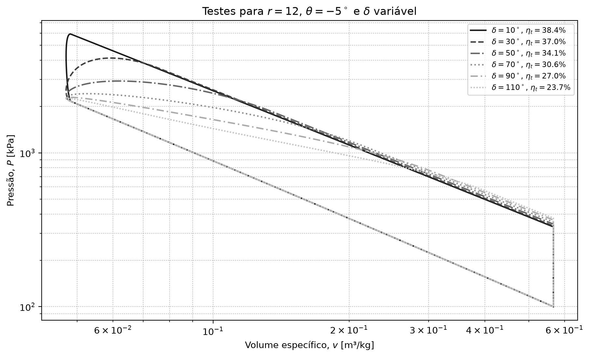

### Diagrama $P\times v$

Em escala linear, observa-se diretamente a redução do trabalho líquido e do pico
de pressão. Para os maiores valores de $\delta$, a pressão máxima passa a ocorrer
ao final da compressão.

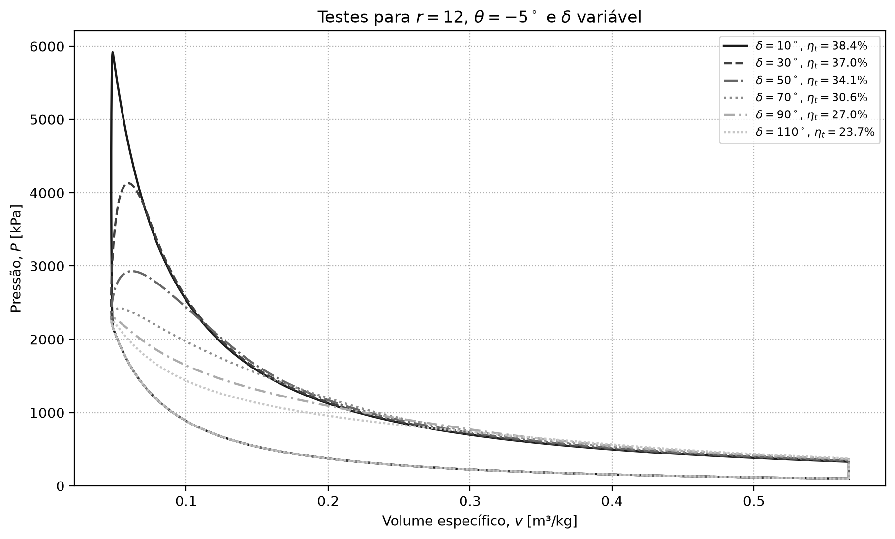

### Diagrama $P\times\alpha$

As diferenças concentram-se ao redor do PMS e no início da expansão. Uma adição
de calor mais longa reduz e desloca o pico de pressão porque parte maior da
energia é fornecida enquanto o pistão se afasta do PMS.

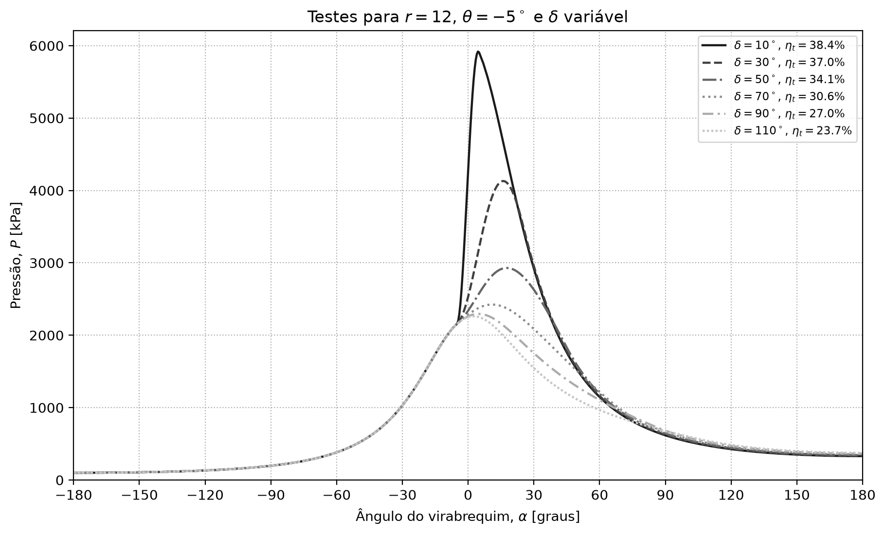

### Diagrama $T\times v$

Com o aumento de $\delta$, o gás leva uma faixa angular maior para aquecer e
atinge a temperatura máxima em volumes específicos maiores. Resta menos curso
para expansão, elevando a temperatura de descarga e reduzindo a eficiência.

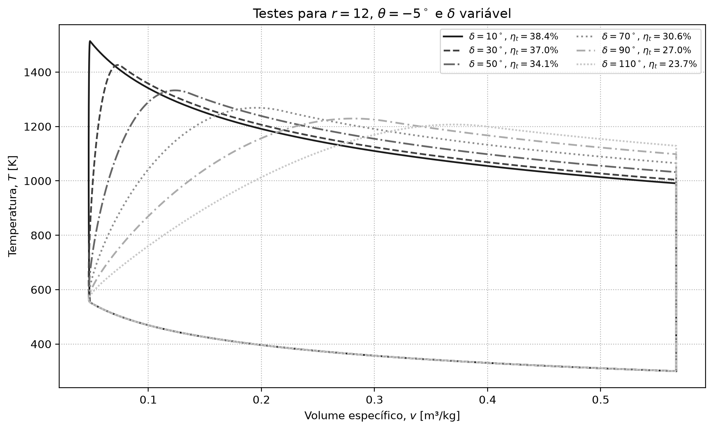

## Análise de sensibilidade

[`src/sensitivity_analysis.py`](src/sensitivity_analysis.py) mantém os
parâmetros físicos e termodinâmicos da validação do artigo. Na varredura, apenas
a rotação $N$ e o instante de ignição $\theta$ variam. A duração temporal de
2,5 ms é a definição do estudo necessária para converter cada rotação na
duração angular $\delta=2\pi N\Delta t_c/60$.

### Ponto de referência do estudo

No caso-base, os parâmetros fixos são:

| Parâmetro | Valor |
|---|---:|
| Volume deslocado unitário | 250 cm³ |
| Número de cilindros | 1 |
| Relação biela/manivela, $L/R$ | 5 |
| Taxa de compressão, $r$ | 12 |
| Rotação, $N$ | 4.800 rpm |
| Início da ignição, $\theta$ | −15° |
| Duração temporal da adição de calor, $\Delta t_c$ | 2,5 ms |
| Duração angular da adição de calor, $\delta$ | 72° |
| Estado inicial | 300 K e 100 kPa |
| Calor específico fornecido, $q_{in}$ | 1.000 kJ/kg |
| Fluido de trabalho | CO₂ |
| Intervalos de compressão e expansão | 90 por processo |
| Passo durante a adição de calor | 0,5° |

O histórico dos 325 estados resultantes está em
[`reports/case_study_base_case_states.csv`](reports/case_study_base_case_states.csv),
e os indicadores estão em
[`reports/case_study_base_case_summary.csv`](reports/case_study_base_case_summary.csv).
Os resultados do caso-base são:

| Indicador | Resultado |
|---|---:|
| Eficiência térmica, $\eta_t$ | 33,257% |
| Trabalho específico de compressão | 198,172 kJ/kg |
| Trabalho específico de expansão | 530,739 kJ/kg |
| Trabalho líquido específico | 332,567 kJ/kg |
| Potência líquida específica | 13.302,7 kW/kg |
| Razão de consumo de trabalho, $r_{ct}$ | 0,373 |
| Pressão máxima, $P_{max}$ | 3.026,2 kPa |
| Temperatura máxima, $T_{max}$ | 1.281,3 K |

#### Diagrama $\log(P)\times\log(v)$ do caso-base

O ciclo fechado inclui a rejeição isocórica de calor. A separação entre os
ramos de compressão e expansão representa o trabalho líquido positivo do ciclo.

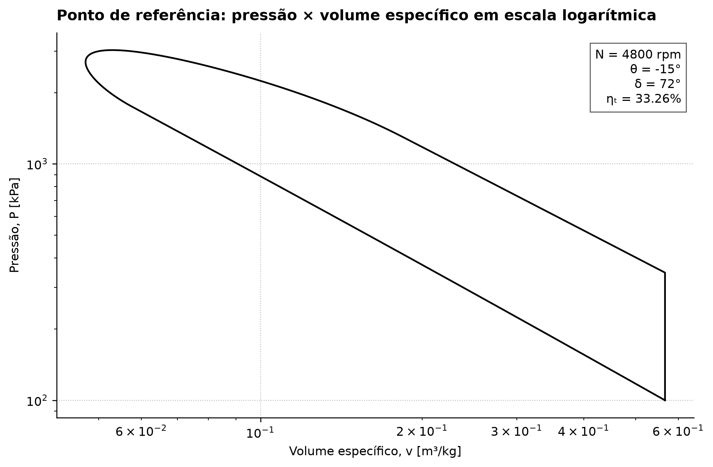

#### Diagrama $P\times v$ do caso-base

Em escala linear, o pico de pressão de 3.026,2 kPa ocorre próximo ao menor
volume específico, durante a liberação finita de calor.

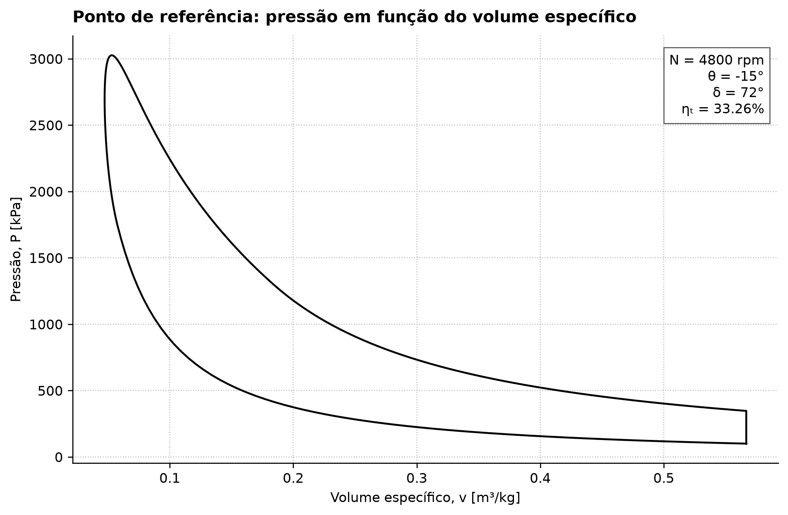

#### Diagrama $P\times\alpha$ do caso-base

A região hachurada identifica a adição de calor entre $\theta=-15^\circ$ e
$\theta+\delta=57^\circ$. A hachura mantém essa informação legível em impressão
preto e branco.

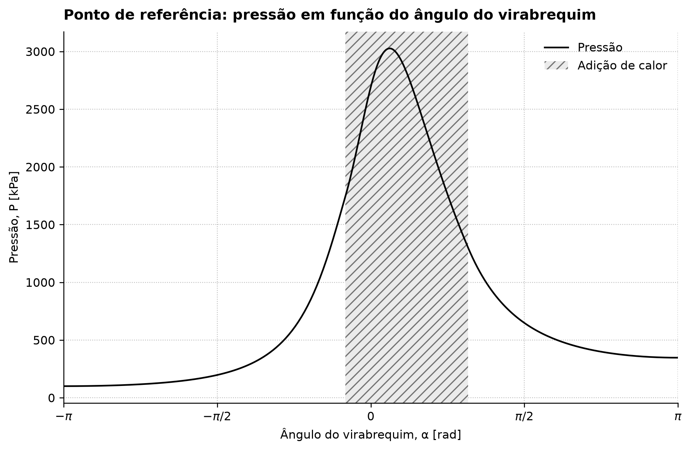

#### Diagrama $T\times v$ do caso-base

A temperatura cresce durante a compressão e a adição de calor, alcança
1.281,3 K e diminui ao longo da expansão. O fechamento vertical representa a
rejeição de calor a volume constante.

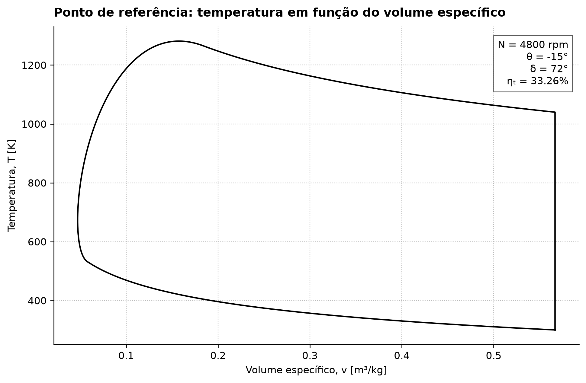

#### Diagrama $n\times\alpha$ do caso-base

Fora da adição de calor, o expoente politrópico permanece próximo ao valor
determinado pelas propriedades do CO₂. Durante a liberação de calor, sua grande
variação representa a combinação entre transferência de energia e mudança de
volume; os pontos isocóricos não possuem expoente finito.

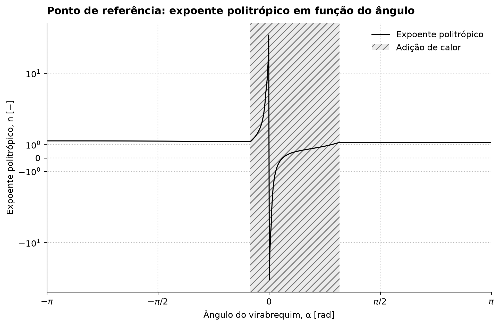

Os cinco diagramas e os cinco gráficos da análise de sensibilidade usam a mesma
identidade visual monocromática. Curvas, hachuras, padrões de traço e marcadores
fornecem codificação redundante para impressão em preto e branco.

### Varredura de rotação e instante de ignição

São avaliadas 120 combinações entre 20
rotações, de 500 a 10.000 rpm em passos de 500 rpm, e seis instantes de ignição:

$$
\theta\in\{-120^\circ,-96^\circ,-72^\circ,-48^\circ,-24^\circ,0^\circ\}.
$$

Todos os demais parâmetros permanecem iguais aos da tabela do ponto de
referência e, portanto, aos parâmetros físicos e termodinâmicos usados na
validação do artigo. A malha conserva 90 intervalos antes e depois da adição de
calor e passo de 0,5° durante esse processo; por isso, seu número de estados
varia de 196 a 481 conforme $N$.

Como $\Delta t_c$ é constante, a duração angular da adição de calor cresce de
7,5° a 150° ao longo da faixa de rotação. Essa relação explica por que o
instante de ignição mais favorável se desloca para ângulos mais adiantados
quando a rotação aumenta.

Os dados completos estão em
[`reports/sensitivity_analysis.csv`](reports/sensitivity_analysis.csv), e os
extremos globais são salvos separadamente em
[`reports/sensitivity_analysis_summary.csv`](reports/sensitivity_analysis_summary.csv).

#### Resultados numéricos

A varredura produziu os seguintes limites globais:

| Indicador | Mínimo ($N$; $\theta$) | Máximo ($N$; $\theta$) |
|---|---:|---:|
| Eficiência térmica | 4,718% (500 rpm; −120°) | 38,280% (500 rpm; 0°) |
| Potência líquida específica | 196,6 kW/kg (500 rpm; −120°) | 25.672,8 kW/kg (10.000 rpm; −72°) |
| Razão de consumo de trabalho | 0,340 (500 rpm; 0°) | 0,938 (500 rpm; −120°) |
| Pressão máxima | 2.225,5 kPa (4.500 rpm; 0°) | 7.831,7 kPa (500 rpm; −120°) |
| Temperatura máxima | 1.171,4 K (10.000 rpm; −24°) | 1.961,0 K (500 rpm; −120°) |

Os resultados ótimos dentro de cada série de instante de ignição são:

| $\theta$ | $\eta_{t,max}$ | $N(\eta_{t,max})$ | $\dot{w}_{liq,max}$ | $N(\dot{w}_{liq,max})$ | $r_{ct,min}$ | $N(r_{ct,min})$ |
|---:|---:|---:|---:|---:|---:|---:|
| −120° | 23,122% | 10.000 rpm | 19.268,2 kW/kg | 10.000 rpm | 0,650 | 10.000 rpm |
| −96° | 28,594% | 10.000 rpm | 23.828,0 kW/kg | 10.000 rpm | 0,536 | 10.000 rpm |
| −72° | 31,809% | 8.000 rpm | **25.672,8 kW/kg** | 10.000 rpm | 0,453 | 10.000 rpm |
| −48° | 34,849% | 5.500 rpm | 24.078,1 kW/kg | 10.000 rpm | 0,401 | 7.000 rpm |
| −24° | 37,349% | 2.500 rpm | 19.564,1 kW/kg | 10.000 rpm | 0,358 | 3.500 rpm |
| 0° | **38,280%** | 500 rpm | 13.872,4 kW/kg | 9.500 rpm | **0,340** | 500 rpm |

Essa tabela explicita três resultados da sensibilidade:

1. o ponto de máxima eficiência desloca-se continuamente para ignições mais
   adiantadas conforme a rotação ótima aumenta: 500 rpm em $0^\circ$, 2.500 rpm
   em $-24^\circ$, 5.500 rpm em $-48^\circ$, 8.000 rpm em $-72^\circ$ e o
   limite de 10.000 rpm em $-96^\circ$ e $-120^\circ$;
2. a maior potência específica não ocorre no ponto de maior eficiência: o
   máximo de 25.672,8 kW/kg exige 10.000 rpm e $\theta=-72^\circ$;
3. a menor razão de consumo de trabalho também depende da combinação entre
   rotação e ignição, variando de 0,340 a 0,650 entre os mínimos das seis
   séries.

Entre 500 e 10.000 rpm, a pressão máxima diminui em todas as séries, com redução
entre 16,1% ($\theta=-120^\circ$) e 61,1% ($\theta=0^\circ$). A temperatura máxima também
diminui, entre 15,4% e 31,2%. Portanto, o aumento de rotação alivia os picos
termodinâmicos, mas não garante simultaneamente a melhor eficiência ou a maior
potência.

As figuras desta seção adotam uma identidade visual própria, diferente da
validação do artigo. Todas as séries são pretas e cada instante de ignição tem
simultaneamente um padrão de traço e um marcador exclusivos. Assim, a leitura
permanece possível em tela, fotocópia ou impressão em preto e branco.

#### Eficiência térmica

A eficiência máxima global, 38,280%, ocorre em 500 rpm e $\theta=0^\circ$.
Entretanto, um único avanço de ignição não é ótimo em toda a faixa: o pico de
eficiência passa de 0° em 500 rpm para −24° em 2.500 rpm, −48° em 5.500 rpm e
−72° em 8.000 rpm. O avanço compensa o aumento da duração angular da adição de
calor e mantém uma parcela maior da liberação de energia próxima ao PMS.

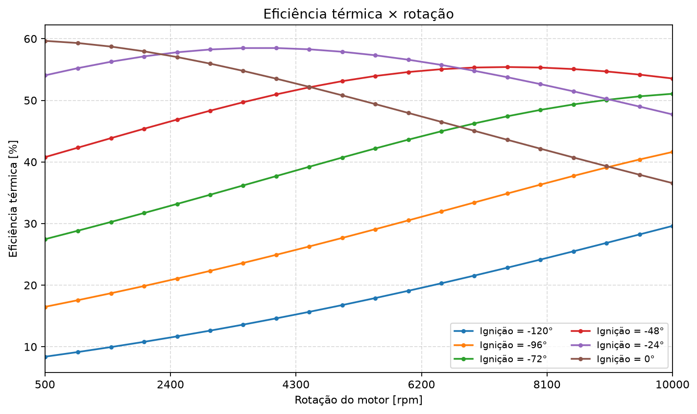

#### Potência líquida específica

A potência líquida específica incorpora simultaneamente o trabalho líquido do
ciclo e sua frequência de repetição. Por isso, seu máximo não coincide com o
de eficiência: são obtidos 25.672,8 kW/kg em 10.000 rpm e $\theta=-72^\circ$.
Esse desacoplamento evidencia um compromisso relevante para a futura
otimização multiobjetivo.

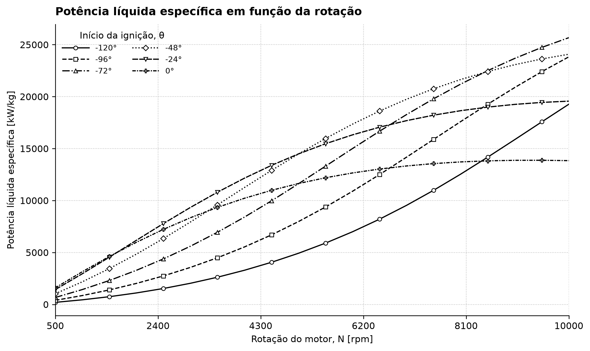

#### Razão de consumo de trabalho

A menor razão de consumo de trabalho, 0,340, coincide com o ponto de maior
eficiência. Para ignições muito adiantadas, uma parcela maior do calor é
fornecida durante a compressão, aumentando a fração do trabalho de expansão
consumida para comprimir o fluido.

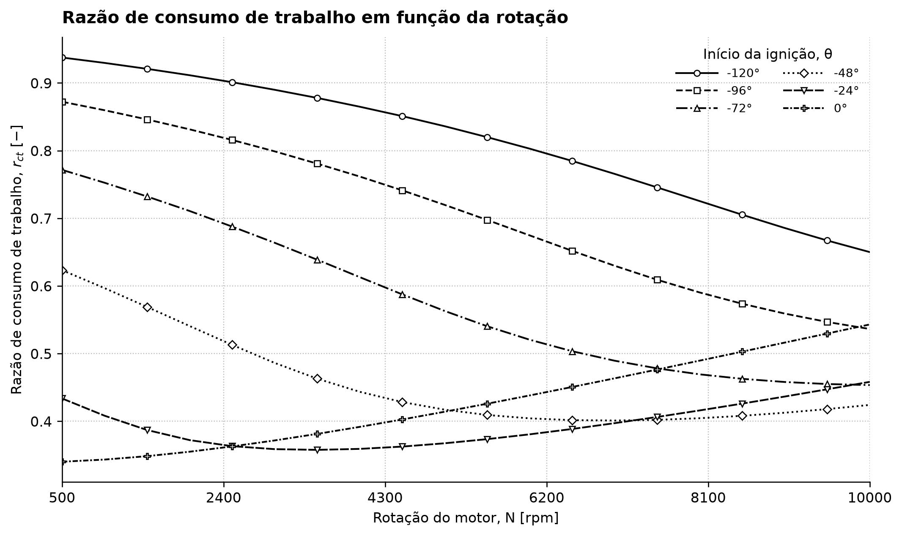

#### Pressão e temperatura máximas

Pressão e temperatura máximas são maiores com ignições antecipadas e baixas
rotações. O caso $N=500$ rpm e $\theta=-120^\circ$ atinge simultaneamente os
maiores valores, 7.831,7 kPa e 1.961,0 K. O alongamento angular da adição de
calor nas rotações elevadas reduz os picos, mas também altera eficiência e
potência; portanto, esses indicadores constituem restrições concorrentes, e
não apenas respostas a serem minimizadas isoladamente.

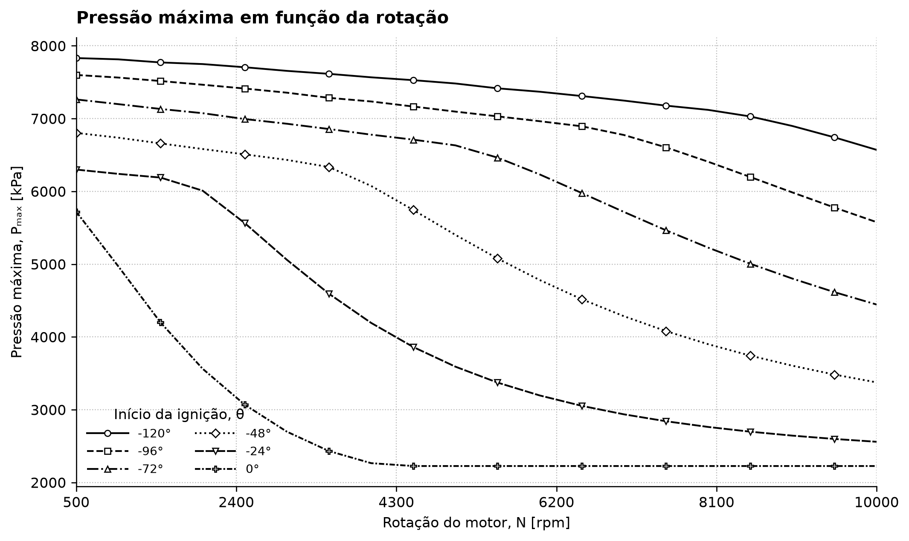

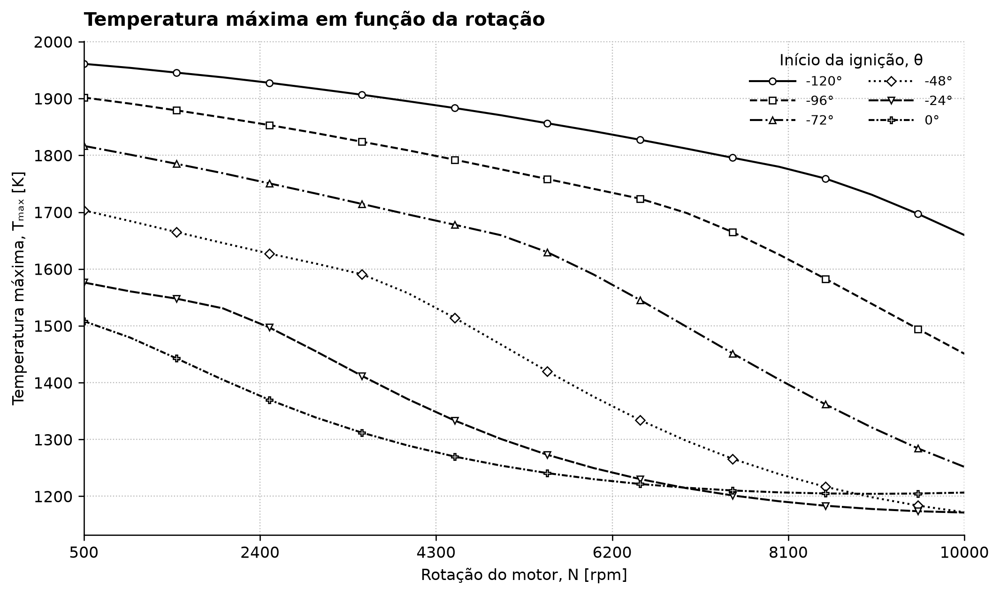

## Otimização multiobjetivo de eficiência e potência

O estudo resolve simultaneamente as duas otimizações propostas,

$$
\max_{N,\theta}\;\eta_t(N,\theta)
\qquad\text{e}\qquad
\max_{N,\theta}\;\dot{w}_{liq}(N,\theta),
$$

sem reduzir o problema a uma única soma ponderada global. O resultado de cada
execução é, portanto, uma aproximação da frente de Pareto: melhorar um dos
indicadores exige aceitar perda no outro.

### Domínio e modelo termodinâmico

As variáveis contínuas são $500\leq N\leq10.000$ rpm e
$-120^\circ\leq\theta\leq0^\circ$. Esses limites preservam integralmente o domínio
exploratório do `e2.2_case_study.ipynb`; não devem ser interpretados como mapa de
calibração de um motor comercial específico. A faixa superior de rotação e a
dependência do avanço com $N$ são compatíveis com ensaios de motores SI — por
exemplo, [Y, Khoa e Lim (2021)](https://doi.org/10.3390/en14154523) estudaram
3.000–10.000 rpm e avanços de 10–45° —, mas o limite de 120° é deliberadamente
mais amplo porque o FTHA impõe uma duração temporal de combustão constante.

Com $\Delta t_c=2{,}5$ ms, a duração angular é
$\delta=6N\Delta t_c$, variando de 7,5° a 150°. Os limites escolhidos mantêm
$\theta+\delta\leq180^\circ$ em todo o domínio. Volume deslocado, número de
cilindros, $L/R$, taxa de compressão, estado inicial, $q_{in}$, CO₂, tolerâncias
e malha são exatamente os parâmetros do artigo já listados no ponto de
referência. Cada avaliação chama diretamente o modelo termodinâmico com 90
intervalos antes e depois da adição de calor e passo de 0,5° durante a
combustão; não foi usado metamodelo ou interpolação.

As decisões são normalizadas em $[0,1]^2$ para os operadores não privilegiarem
a rotação apenas por sua escala numérica. Para o mesmo motivo, as funções de
minimização fornecidas aos algoritmos são $-\eta_t/40\%$ e
$-\dot{w}_{liq}/27.000$, escalas fixas arredondadas acima dos máximos da análise
de sensibilidade. Escala positiva não altera dominância de Pareto.

### Algoritmos, frameworks e parâmetros

Foram comparados quatro métodos, sempre com 24 candidatos, 20 gerações além da
população inicial e **504 avaliações exatas por execução**. Cada método foi
executado 21 vezes com sementes independentes e reproduzíveis; assim, o estudo
totaliza 84 execuções e 42.336 chamadas do ciclo FTHA. O tamanho 24 fornece boa
cobertura para apenas dois objetivos e duas decisões, é múltiplo de quatro
exigido pelo torneio DCD do NSGA-II e mantém viável a repetição estatística do
modelo termodinâmico. O orçamento idêntico é mais importante para esta
comparação que reproduzir populações muito maiores usadas em funções-teste
baratas dos artigos originais.

| Método | Implementação e escolhas |
|---|---|
| NSGA-II | [DEAP `selNSGA2`](https://deap.readthedocs.io/en/master/api/tools.html#deap.tools.selNSGA2), torneio DCD e elitismo; SBX com $p_c=0{,}9$ e $\eta_c=20$; mutação polinomial com $\eta_m=20$ e probabilidade $1/n_{var}=0{,}5$ por variável. Segue os operadores reais do [NSGA-II de Deb et al.](https://doi.org/10.1109/4235.996017). |
| NSGA-III | [DEAP `selNSGA3`](https://deap.readthedocs.io/en/stable/examples/nsga3.html), os mesmos operadores do NSGA-II e 24 pontos de referência uniformes ($p=23$). O método foi proposto para muitos objetivos por [Deb e Jain](https://doi.org/10.1109/TEVC.2013.2281535); aqui sua inclusão em duas dimensões é comparativa, não uma alegação de vantagem esperada. |
| MOPSO | O [PySwarm 1.0](https://pypi.org/project/pyswarm/) fornece PSO escalar. Sua equação e padrões $\omega=c_1=c_2=0{,}5$ foram estendidos com dominância, repositório externo de até 96 soluções e líderes favorecidos por menor densidade, conforme o [MOPSO de Coello Coello e Lechuga](https://doi.org/10.1109/CEC.2002.1004388). Uma perturbação de probabilidade inicial 0,10, decrescente até zero, reduz estagnação. |
| MOEA/D | [`MOEAD` do pymoo](https://pymoo.org/algorithms/moo/moead.html), 24 direções uniformes, decomposição de Tchebycheff, 10 vizinhos e probabilidade 0,9 de acasalamento na vizinhança; SBX e mutação iguais aos métodos DEAP. A decomposição e cooperação local seguem [Zhang e Li](https://doi.org/10.1109/TEVC.2007.892759). |

As versões, sementes e todos os hiperparâmetros estão registrados de forma
legível por máquina em
[`reports/multiobjective_configuration.csv`](reports/multiobjective_configuration.csv).

### Estatísticas e critério de melhor solução

Uma frente não possui uma única “melhor” solução sem preferência externa. Para
calcular média e desvio padrão de decisões e respostas, cada execução fornece
um ponto de compromisso: primeiro calculam-se ideal e nadir da frente não
dominada combinada das 84 execuções; em seguida escolhe-se a menor distância
euclidiana ao ideal, com perdas de eficiência e potência normalizadas pelo
intervalo ideal–nadir e pesos iguais. A melhor solução de cada algoritmo é o
menor valor desse mesmo escore entre todas as suas frentes.

O hipervolume usa a referência física $(\eta_t,\dot{w}_{liq})=(0,0)$ após as
escalas fixas. Valores maiores indicam simultaneamente melhor convergência e
cobertura. O tempo contém seleção e as 504 avaliações exatas, mas não a criação
inicial do conjunto de processos, compartilhado por todo o experimento. O
paralelismo altera apenas o tempo: sementes, avaliações e resultados não
dependem da ordem de conclusão das tarefas.

### Resultados das 21 execuções

As 84 execuções concluíram as 42.336 avaliações previstas, sem ponto inválido ou
falha de convergência. Média e desvio padrão das métricas de qualidade e custo
foram:

| Algoritmo | Hipervolume médio ± DP | Melhor hipervolume | Tempo médio ± DP [s] |
|---|---:|---:|---:|
| NSGA-II | **0,84463 ± 0,00292** | 0,84755 | 9,64 ± 1,11 |
| NSGA-III | 0,84293 ± 0,00269 | 0,84616 | 9,86 ± 1,01 |
| MOPSO | 0,83867 ± 0,01387 | **0,85007** | **9,27 ± 0,80** |
| MOEA/D | 0,82660 ± 0,01048 | 0,84052 | 34,31 ± 1,85 |

O NSGA-II apresentou o maior hipervolume médio e baixa dispersão; o NSGA-III
ficou 0,20% abaixo em média e teve dispersão semelhante. O MOPSO encontrou a
melhor frente isolada e foi o mais rápido, mas três execuções de qualidade
inferior aumentaram seu desvio; sua mediana foi 0,84557. O MOEA/D convergiu para
frentes úteis, porém obteve hipervolume médio 2,13% abaixo do NSGA-II e levou
3,56 vezes mais tempo. Esse custo decorre da atualização sequencial dos
subproblemas vizinhos na implementação do pymoo, que aproveita menos o
paralelismo entre avaliações.

O MOPSO pode devolver até 96 membros de seu repositório, enquanto os outros
métodos devolvem no máximo 24 membros da população. O hipervolume foi calculado
sobre a saída completa de cada método; portanto, ele mede a frente efetivamente
entregue ao usuário, mas parte da vantagem de densidade de uma execução MOPSO
decorre dessa memória externa. A conclusão mais robusta é a estabilidade do
NSGA-II, não superioridade universal de um algoritmo.

Os pontos de compromisso de pesos iguais apresentaram as seguintes médias
entre sementes:

| Algoritmo | $N$ médio ± DP [rpm] | $\theta$ médio ± DP [°] | $\eta_t$ média ± DP [%] | Potência média ± DP [kW/kg] |
|---|---:|---:|---:|---:|
| NSGA-II | 5.169 ± 255 | −36,86 ± 2,34 | 35,632 ± 0,229 | 15.344,8 ± 657,9 |
| NSGA-III | 5.199 ± 189 | −37,44 ± 2,17 | 35,602 ± 0,176 | 15.421,9 ± 483,6 |
| MOPSO | **5.234 ± 82** | **−37,73 ± 0,76** | **35,586 ± 0,076** | **15.522,2 ± 209,7** |
| MOEA/D | 5.445 ± 455 | −38,69 ± 5,24 | 35,337 ± 0,407 | 16.018,4 ± 1.154,1 |

O negrito na linha do MOPSO destaca a menor dispersão, e não o maior valor de
cada objetivo. Os quatro métodos localizaram a mesma região de compromisso,
aproximadamente 5.200 rpm e 38° antes do PMS. O MOEA/D tendeu a selecionar mais
potência com alguma perda de eficiência e apresentou a maior variabilidade.

As melhores soluções de compromisso — menor distância normalizada ao ideal —
foram:

| Algoritmo | Execução | $N$ [rpm] | $\theta$ [°] | $\eta_t$ [%] | Potência [kW/kg] | Escore |
|---|---:|---:|---:|---:|---:|---:|
| NSGA-II | 15 | 5.217,6 | −38,116 | 35,599 | 15.478,7 | 0,398572 |
| NSGA-III | 14 | 5.201,4 | −37,439 | 35,617 | 15.438,2 | 0,398393 |
| MOPSO | 14 | 5.230,3 | −37,596 | 35,591 | 15.512,4 | **0,398370** |
| MOEA/D | 8 | 5.304,6 | −37,389 | 35,519 | 15.701,0 | 0,398735 |

As diferenças entre esses escores são pequenas: não há evidência de que uma
dessas quatro alternativas de compromisso domine as demais. A escolha final
depende da preferência entre eficiência e potência. Nos extremos da frente
conjunta, a maior eficiência foi 38,435% em 500 rpm e −3,582°, com
1.601,4 kW/kg; a maior potência foi 25.675,9 kW/kg em 9.999,9 rpm e −70,873°,
com eficiência de 30,811%. Esses extremos refinam os valores da varredura
discreta e confirmam o conflito entre os objetivos.

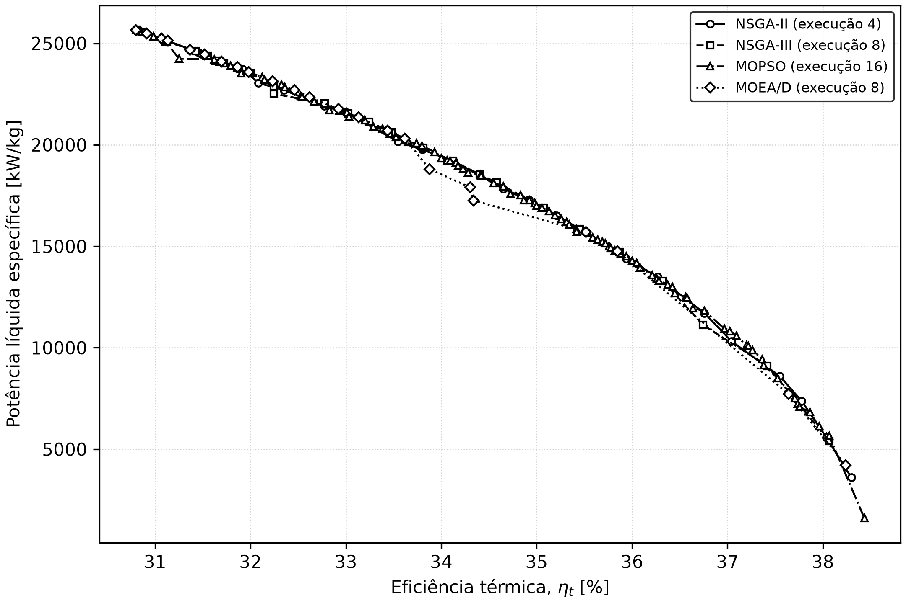

A figura mostra a execução de maior hipervolume de cada método. Padrões de
traço e marcadores redundantes mantêm as quatro frentes distinguíveis em
impressão preto e branco.

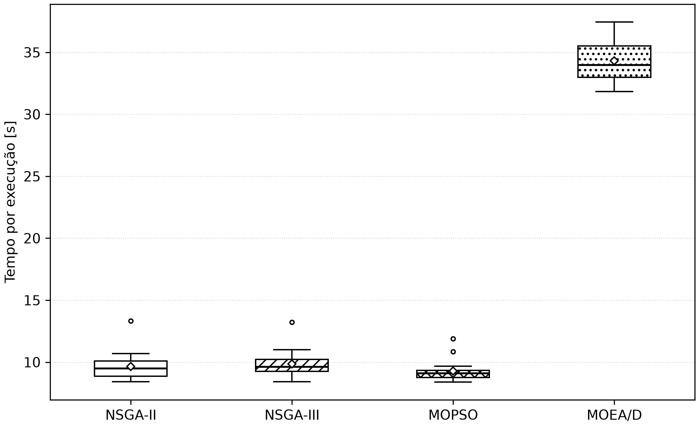

Os resultados completos podem ser auditados em:

- [`reports/multiobjective_pareto_solutions.csv`](reports/multiobjective_pareto_solutions.csv):
  3.414 soluções não dominadas, com semente e execução;
- [`reports/multiobjective_run_statistics.csv`](reports/multiobjective_run_statistics.csv):
  84 linhas com hipervolume, ponto de compromisso e tempo;
- [`reports/multiobjective_summary.csv`](reports/multiobjective_summary.csv):
  médias, desvios padrão e melhor solução por algoritmo;
- [`reports/multiobjective_best_solutions.csv`](reports/multiobjective_best_solutions.csv):
  os quatro compromissos destacados na tabela anterior.

## Interface Python

`simulate_cycle` retorna o histórico termodinâmico completo. Para obter somente
os indicadores de um ponto de operação, use `evaluate_operating_point`. A função
`objective_function` retorna os cinco objetivos segundo uma convenção de
minimização:

1. negativo da eficiência térmica;
2. negativo da potência líquida específica;
3. razão de consumo de trabalho;
4. pressão máxima;
5. temperatura máxima.

```python
from src.FTHA import OBJECTIVE_NAMES, objective_function

objectives = objective_function([4_500.0, -48.0])
print(dict(zip(OBJECTIVE_NAMES, objectives)))
```

## Estrutura do projeto

- `src/FTHA.py`: modelo termodinâmico e função objetivo;
- `src/gas_prop.py`: propriedades do gás ideal com calores específicos
  variáveis;
- `src/article_validation.py`: reprodução dos seis testes paramétricos e geração
  dos quatro diagramas de validação;
- `src/base_case_analysis.py`: caso-base específico da validação do artigo, com
  $\theta=-5^\circ$ e $\delta=10^\circ$;
- `src/sensitivity_analysis.py`: ponto de referência e varredura de rotação e
  instante de ignição com os demais parâmetros do artigo, exportação dos
  resultados e dez gráficos para impressão em preto e branco;
- `src/multiobjective_optimization.py`: comparação reproduzível entre NSGA-II,
  NSGA-III, MOPSO e MOEA/D para maximizar eficiência e potência em 21 sementes;
- `data/data.csv`: coeficientes polinomiais das propriedades dos gases;
- `img/`: artefatos gráficos gerados;
- `reports/`: histórico e resumo do ponto de referência, resultados tabulares
  da varredura, frentes de Pareto, estatísticas por execução e resumo da
  otimização;
- `tests/test_article_validation.py`: regressão numérica dos seis casos
  publicados;
- `tests/test_ftha.py`: regressão e validação da interface do modelo.
- `tests/test_multiobjective_optimization.py`: dominância, crowding, limites e
  agregação estatística do estudo multiobjetivo.

A localização do CSV e dos diretórios de saída é calculada a partir da raiz do
projeto e não depende do diretório corrente usado para iniciar o Python.

## Ambiente e validação

O projeto usa Python 3.13 e `uv`:

```bash
uv sync
uv run python -m unittest discover -s tests
uv run python -m src.article_validation
uv run python -m src.base_case_analysis
uv run python -m src.sensitivity_analysis
uv run python -m src.multiobjective_optimization
uv run python -c "from src.FTHA import objective_function; print(objective_function([4500, -48]))"
```

## Referências

- NAAKTGEBOREN, Christian. An air-standard finite-time heat addition Otto engine
  model. *International Journal of Mechanical Engineering Education*, Londres,
  v. 45, n. 2, p. 103–119, 2017. DOI: 10.1177/0306419016689447.
- ÇENGEL, Y. A.; BOLES, M. A. *Termodinâmica*. 7ª ed. Porto Alegre: Grupo A,
  2013.
- Y, Quach Nhu; KHOA, Nguyen-Xuan; LIM, Ock Taeck. A study on the effect of
  ignition timing on residual gas, effective release energy, and engine
  emissions of a V-twin engine. *Energies*, v. 14, n. 15, 4523, 2021.
  DOI: [10.3390/en14154523](https://doi.org/10.3390/en14154523).
- DEB, Kalyanmoy et al. A fast and elitist multiobjective genetic algorithm:
  NSGA-II. *IEEE Transactions on Evolutionary Computation*, v. 6, n. 2,
  p. 182–197, 2002. DOI:
  [10.1109/4235.996017](https://doi.org/10.1109/4235.996017).
- DEB, Kalyanmoy; JAIN, Himanshu. An evolutionary many-objective optimization
  algorithm using reference-point-based nondominated sorting approach, part I.
  *IEEE Transactions on Evolutionary Computation*, v. 18, n. 4, p. 577–601,
  2014. DOI:
  [10.1109/TEVC.2013.2281535](https://doi.org/10.1109/TEVC.2013.2281535).
- COELLO COELLO, Carlos A.; LECHUGA, Maximino Salazar. MOPSO: a proposal for
  multiple objective particle swarm optimization. In: *Congress on
  Evolutionary Computation*, 2002. DOI:
  [10.1109/CEC.2002.1004388](https://doi.org/10.1109/CEC.2002.1004388).
- ZHANG, Qingfu; LI, Hui. MOEA/D: a multiobjective evolutionary algorithm based
  on decomposition. *IEEE Transactions on Evolutionary Computation*, v. 11,
  n. 6, p. 712–731, 2007. DOI:
  [10.1109/TEVC.2007.892759](https://doi.org/10.1109/TEVC.2007.892759).
- FORTIN, Félix-Antoine et al. DEAP: evolutionary algorithms made easy.
  *Journal of Machine Learning Research*, v. 13, p. 2171–2175, 2012.
- BLANK, Julian; DEB, Kalyanmoy. pymoo: multi-objective optimization in Python.
  *IEEE Access*, v. 8, p. 89497–89509, 2020. DOI:
  [10.1109/ACCESS.2020.2990567](https://doi.org/10.1109/ACCESS.2020.2990567).
